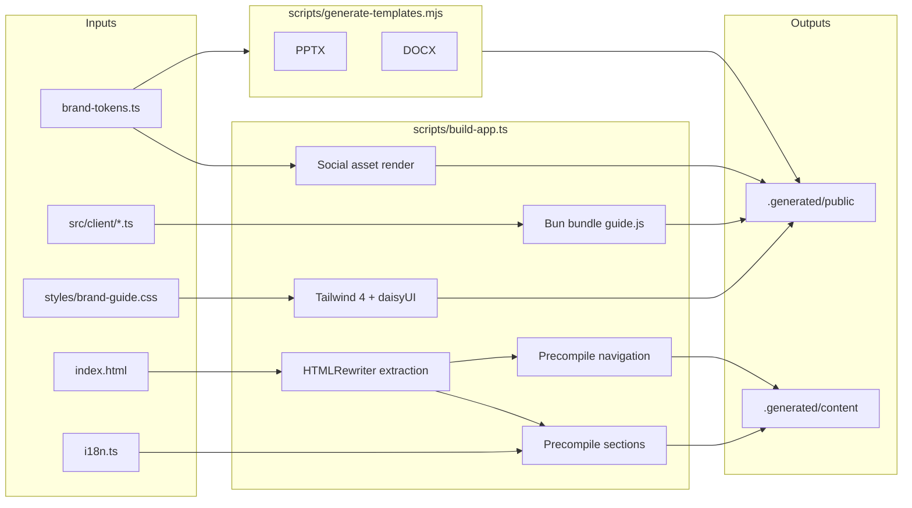
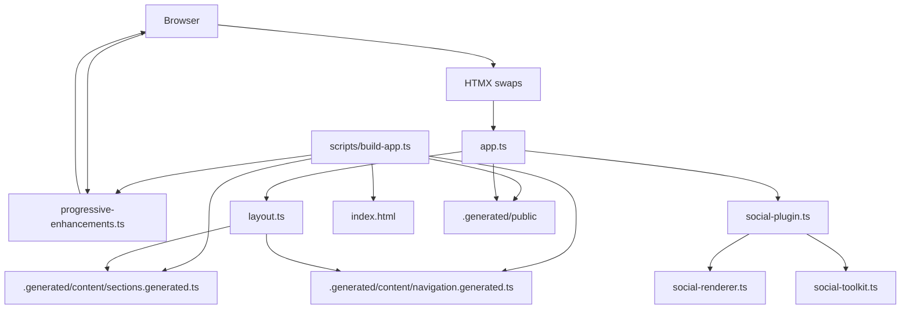

# VERTU Brand Guide / VERTU 品牌指南

[](./package.json)
[](https://bun.sh)
[](https://elysiajs.com)
[](https://www.typescriptlang.org/)
[](https://htmx.org)
[](https://tailwindcss.com)
[](https://daisyui.com)
[](./package.json)
[](https://bun.sh)
[](https://biomejs.dev)
[](https://prettier.io)

**English:** SSR-first VERTU brand guide built on Bun, Elysia, HTMX, Tailwind CSS 4, and daisyUI 5. The app renders a branded full-screen cover plus a server-owned guide shell, with browser JavaScript limited to progressive enhancement such as HTMX runtime boot, syntax highlighting, focus management, clipboard actions, and canvas exports through a single compiled client asset. Section markup is precompiled per language during the build so the server reads typed fragments instead of re-localizing authoring HTML on every request. Generated document templates, social-renderer palettes, and the downloadable HTML guide snapshot share typed release metadata and brand tokens with the UI so the build pipeline and runtime stay aligned, and unchanged canonical social outputs are fingerprint-reused across verification runs instead of being rerendered on every cycle.

**中文：** 基于 Bun、Elysia、HTMX、Tailwind CSS 4 和 daisyUI 5 构建的 SSR 优先 VERTU 品牌指南。应用渲染品牌全屏封面与服务端持有的指南壳层，浏览器端 JavaScript 仅用于渐进增强（如 HTMX 运行时启动、语法高亮、焦点管理、剪贴板操作、Canvas 导出），通过单一编译客户端资源交付。章节标记在构建时按语言预编译，服务端直接读取类型化片段，无需在每次请求时重新本地化创作 HTML。生成的文档模板、社交渲染配色以及可下载的 HTML 指南快照与 UI 共享类型化发布元数据和品牌 Token，构建流水线与运行时保持一致；未变化的规范社交输出会在校验运行间基于指纹复用，而不是每次都重新渲染整套矩阵。

## Table of Contents / 目录

- [Quick Start / 快速开始](#quick-start--快速开始)
- [Features / 功能特性](#features--功能特性)
- [Stack / 技术栈](#stack--技术栈)
- [Architecture / 架构](#architecture--架构)
- [Social Toolkit Surfaces / 社交素材工具包接口](#social-toolkit-surfaces--社交素材工具包接口)
- [View State / 视图状态](#view-state--视图状态)
- [Server Entrypoints / 服务入口](#server-entrypoints--服务入口)
- [Repository Layout / 仓库结构](#repository-layout--仓库结构)
- [Commands / 命令](#commands--命令)
- [Railway / Railpack](#railway--railpack)
- [Environment Variables / 环境变量](#environment-variables--环境变量)
- [Dot Files and .gitignore / 点文件与 .gitignore](#dot-files-and-gitignore--点文件与-gitignore)
- [Notes / 说明](#notes--说明)
- [AI Docs / AI 文档](#ai-docs--ai-文档)

## Quick Start / 快速开始

**English:**

1. **Prerequisites:** [Bun](https://bun.sh) 1.3 or later.
2. **Clone and install:** `git clone <repo> && cd vertu-brand-guide && bun install`
3. **Run dev server:** `bun run dev` — builds, watches, and serves on port 3000.
4. **Optional:** `bun run build` for full build, `bun run test` for tests, `bun run audit` for SSR/accessibility/policy audit.

**中文：**

1. **环境要求：** [Bun](https://bun.sh) 1.3 或更高版本。
2. **克隆并安装：** `git clone <repo> && cd vertu-brand-guide && bun install`
3. **启动开发服务器：** `bun run dev` — 构建、监听并在端口 3000 提供服务。
4. **可选：** `bun run build` 完整构建，`bun run test` 运行测试，`bun run audit` 执行 SSR/无障碍/策略审计。

## Features / 功能特性

**English:**

- SSR-first rendering with HTMX fragment swaps
- Bilingual (EN/ZH) with build-time localization
- Social asset toolkit (OG cards, carousel frames, pack manifests)
- Logo generator with contrast validation
- Downloadable templates (PPTX, DOCX, HTML)
- Accessibility (ARIA, focus management, reduced motion)
- Theme support (light/dark/system)

**中文：**

- SSR 优先渲染与 HTMX 片段交换
- 双语（英文/中文）与构建时本地化
- 社交素材工具包（OG 卡片、轮播帧、套件清单）
- 标志生成器与对比度校验
- 可下载模板（PPTX、DOCX、HTML）
- 无障碍（ARIA、焦点管理、减少动画）
- 主题支持（明/暗/系统）

## Stack / 技术栈

| Layer / 层级                    | Technology / 技术                                                             |
| ------------------------------- | ----------------------------------------------------------------------------- |
| Runtime / 运行时                | Bun 1.3                                                                       |
| Server / 服务端                 | Elysia                                                                        |
| Rendering / 渲染                | SSR HTML + HTMX fragment swaps                                                |
| Styling / 样式                  | Tailwind CSS 4 build + daisyUI 5 plugin + imported guide overrides            |
| Client enhancement / 客户端增强 | Bundled HTMX, Prism, and progressive enhancement served as `/assets/guide.js` |
| Templates / 模板                | `pptxgenjs` + `docx`                                                          |
| Testing / 测试                  | `bun run test`                                                                |

## Architecture / 架构

### Request Flow / 请求流程


### Build Pipeline / 构建流水线



### Component Relationships / 组件关系



## Social Toolkit Surfaces / 社交素材工具包接口

**English:**

- `GET /social/:preset.png` renders a bounded PNG asset from preset-driven inputs.
- `GET /social/carousel/:preset/:frame.png` renders preset-bounded carousel frames.
- `GET /social/packs/:packId` returns the typed JSON pack manifest only.
- `GET /social/preview` returns the HTMX preview fragment markup for the operator panel.
- Canonical build assets are emitted under `.generated/public/assets/social/`.
- Canonical build manifests are emitted under `.generated/public/assets/social/manifests/`.

**中文：**

- `GET /social/:preset.png` 根据预设输入渲染有界 PNG 素材。
- `GET /social/carousel/:preset/:frame.png` 渲染预设有界的轮播帧。
- `GET /social/packs/:packId` 仅返回类型化 JSON 套件清单。
- `GET /social/preview` 返回操作面板的 HTMX 预览片段标记。
- 规范构建素材输出至 `.generated/public/assets/social/`。
- 规范构建清单输出至 `.generated/public/assets/social/manifests/`。

## View State / 视图状态

**English:**

- `section`, `lang`, and `theme` are URL-owned state.
- `GET /` returns the full SSR document.
- `GET /` with `HX-Request: true` returns either `#guide-page` or `#guide-shell` based on `HX-Target`.
- `GET /` with `HX-History-Restore-Request: true` returns a full document and the response varies on HTMX request headers.
- `#guide-page` owns the branded cover, request indicator, toast container, scroll progress bar, and the top-level language/theme state.
- `#guide-shell` owns section navigation, sidebar state, main-region focus, and section-only swaps.
- Sidebar navigation uses `hx-boost` and swaps `#guide-shell`, while language/theme controls swap `#guide-page` so the cover and shell update together.
- Global controls use `hx-sync="#guide-page:replace"` and section links use `hx-sync="#guide-shell:replace"` so stale requests are replaced instead of racing.
- HTMX requests share a single daisyUI-backed request indicator and disabled-element contract so loading state is visible without custom request spinners in JavaScript.
- `#guide-page` is marked with `hx-history-elt` so HTMX snapshots the branded page wrapper instead of the entire body.
- During HTMX navigation, the page, shell, and main region expose `aria-busy`, then the browser layer restores focus to the main region and keeps section swaps aligned to the top of the guide stage instead of the cover.
- Invalid sections return HTTP `404` and fall back to `s0` with an in-page alert.
- Guide-owned SSR, download, and social toolkit responses include a correlation id header, and request completion/error events are emitted through the shared structured logger.

**中文：**

- `section`、`lang`、`theme` 由 URL 持有。
- `GET /` 返回完整 SSR 文档。
- 带 `HX-Request: true` 的 `GET /` 根据 `HX-Target` 返回 `#guide-page` 或 `#guide-shell`。
- 带 `HX-History-Restore-Request: true` 的 `GET /` 返回完整文档，响应随 HTMX 请求头变化。
- `#guide-page` 持有品牌封面、请求指示器、Toast 容器、滚动进度条及顶层语言/主题状态。
- `#guide-shell` 持有章节导航、侧边栏状态、主区域焦点及仅章节交换。
- 侧边栏导航使用 `hx-boost` 并交换 `#guide-shell`，语言/主题控件交换 `#guide-page`，封面与壳层同步更新。
- 全局控件使用 `hx-sync="#guide-page:replace"`，章节链接使用 `hx-sync="#guide-shell:replace"`，以替换过期请求而非竞态。
- HTMX 请求共享单一 daisyUI 请求指示器与禁用元素契约，加载状态可见，无需自定义 JavaScript 请求动画。
- `#guide-page` 标记为 `hx-history-elt`，HTMX 快照品牌页面包装器而非整个 body。
- HTMX 导航期间，页面、壳层与主区域暴露 `aria-busy`，浏览器层恢复主区域焦点，章节交换与指南舞台顶部对齐而非封面。
- 无效章节返回 HTTP `404`，并回退至 `s0` 及页内提示。
- 指南自有 SSR、下载与社交工具包响应都会附带关联请求 id 头，且请求完成/错误事件都会通过共享结构化日志输出。

## Server Entrypoints / 服务入口

| Entrypoint / 入口     | Default port / 默认端口 | Purpose / 用途                                             |
| --------------------- | ----------------------- | ---------------------------------------------------------- |
| `src/server/index.ts` | `3000`                  | Development server started by `bun run dev`                |
| `src/server/serve.ts` | `3090`                  | Typed static-preview entrypoint for built-asset validation |

**English:** Both entrypoints use one shared port-resolution contract from `runtime-config.ts`, one shared boot contract from `src/server/boot.ts`, and shared defaults from `src/shared/runtime-settings.ts`. They respect `GUIDE_PORT`, also fall back to `PORT` for container platforms like Railway, and support `-l`/`--listen` CLI flags.

**中文：** 两个入口共用 `runtime-config.ts` 中的端口解析契约、`src/server/boot.ts` 中的启动契约，并共享 `src/shared/runtime-settings.ts` 中的默认值。它们都遵循 `GUIDE_PORT`，也都会回退到容器平台常见的 `PORT`，并支持 `-l`/`--listen` CLI 参数。

## Repository Layout / 仓库结构

```text
src/
  client/
    logo-generator.ts      # Canvas logo export enhancement
    progressive-enhancements.ts # Bundled HTMX + Prism runtime, clipboard, focus, playgrounds, canvas generators
    social-toolkit.ts      # Social toolkit form normalization and bounded option sync
    styles/
      guide.css             # Tailwind 4 + daisyUI entry for the compiled asset bundle
  server/
    app.ts                 # Elysia routes + official static plugin wiring
    boot.ts                # Shared boot contract for dev and serve entrypoints
    index.ts               # Development server entrypoint (used by scripts/dev.ts)
    observability-plugin.ts # Shared request-id propagation and structured request logging
    serve.ts               # Typed dedicated serve entrypoint for the local static-preview port
    social-plugin.ts       # Elysia plugin for social render + preview + pack routes
    social-renderer.ts     # Satori + Resvg renderer and preview-model helpers using shared brand tokens
    runtime-config.ts      # Server-only filesystem paths + shared port resolver using Bun-native module-relative paths
    content/
      generated.ts         # Re-exports generated section and navigation registries
      navigation.ts        # Canonical section navigation metadata
      source.ts            # Renders localized sections from the generated registry
    render/
      layout.ts            # SSR document, branded cover, and HTMX shell rendering
  shared/
    asset-operator-contract.ts # Shared DOM ids for download/logo/social toolkit markup and tests
    authoring-guide.ts     # Bun HTMLRewriter-based authoring extraction and asset URL normalization
    brand-tokens.ts        # Shared brand palette, font families, and social theme tokens
    config.ts              # Public routes, download ids, and server runtime defaults
    guide-interactions.ts  # Typography playground and scroll-progress computation
    htmx-event-contract.ts # Typed HTMX browser event names, detail payloads, and target resolution
    i18n.ts                # Shared bilingual copy
    logger.ts              # Structured logging
    markup.ts              # HTML label audits + markup text helpers
    repository-policy.ts   # Filesystem and AST policy checks for audits
    runtime-settings.ts    # Typed shared runtime defaults, env parsing, and warning logging
    section-markup.ts      # Build-time section localization and ARIA normalization
    shell-contract.ts      # Shared SSR/client/test DOM ids, selectors, and HTMX shell wiring
    social-toolkit.ts      # Social preset registry, contracts, request normalization, and manifest builders
    template-catalog.ts    # Shared release metadata and generated template registry
    template-markup.ts     # Server-owned template library cards for the downloads section
    view-state.ts          # URL state normalization

tests/
  accessibility.test.ts
  app.test.ts
  http-e2e.test.ts
  policy.test.ts
  social-toolkit.test.ts

scripts/
  audit-brand-guide.ts     # SSR/accessibility/policy audit
  build-app.ts             # Builds assets, precompiled sections/navigation, and the bounded public surface
  dev.ts                   # Local boot orchestrator: initial build, filesystem watching, rebuild, and server restart
  generate-templates.mjs   # Generates canonical PPTX + DOCX source files from shared catalog + brand tokens

index.html                 # Authoring source for section markup and guide prose
styles/brand-guide.css     # Visual system + SSR shell overrides
.generated/                # Build output: public assets + generated section registry
```

## Commands / 命令

```bash
bun run dev            # Full local boot: build → watch → serve on port 3000
bun run build          # Run build:templates then build:app
bun run build:app      # HTMLRewriter extraction, Tailwind/Bun bundling, public surface assembly
bun run lint           # Run Biome across TypeScript, CSS, JSON, and authored HTML surfaces
bun run serve          # Static-preview server on port 3090
bun run build:templates # Generate canonical PPTX + DOCX brand templates
bun run typecheck      # Run the TypeScript compiler in check-only mode
bun run test           # Run all tests including live HTTP smoke suite
bun run audit          # SSR, accessibility, and policy audit
bun run format         # Format source files with Prettier
bun run format:check   # Verify formatting without writing changes
```

## Railway / Railpack

**English:**

- `railway.json` pins Railway to the `RAILPACK` builder for services created before Railpack became the default builder.
- Railway uses Railpack zero-config for this repo: it detects Bun from `package.json`, runs `bun run build`, and starts from the `start` script in `package.json`.
- When Railway injects `PORT`, the server automatically binds to `0.0.0.0`; `GUIDE_HOST` still overrides that when explicitly set.

**中文：**

- `railway.json` 将 Railway 构建器固定为 `RAILPACK`，兼容 Railpack 成为默认构建器之前创建的服务。
- 这个仓库在 Railway 上使用 Railpack 零配置：从 `package.json` 检测 Bun，执行 `bun run build`，并通过 `package.json` 里的 `start` 脚本启动。
- 当 Railway 注入 `PORT` 时，服务器会自动绑定到 `0.0.0.0`；如果显式设置了 `GUIDE_HOST`，则仍以它为准。

## Environment Variables / 环境变量

| Variable                                            | Default        | Description / 说明                                                                                             |
| --------------------------------------------------- | -------------- | -------------------------------------------------------------------------------------------------------------- |
| `GUIDE_HOST`                                        | `localhost`    | Shared listen hostname and canonical local origin host; container fallback is `0.0.0.0` when `PORT` is present |
| `GUIDE_DEFAULT_PORT`                                | `3000`         | Default development server port before `GUIDE_PORT` / CLI overrides                                            |
| `GUIDE_SERVE_PORT`                                  | `3090`         | Default static-preview port before `GUIDE_PORT` overrides                                                      |
| `GUIDE_PORT`                                        | —              | Overrides the default port for either server                                                                   |
| `PORT`                                              | —              | Railway/container port that also switches the default bind host to `0.0.0.0`                                   |
| `GUIDE_REQUEST_ID_HEADER`                           | `x-request-id` | Response/request correlation header name                                                                       |
| `GUIDE_STATIC_ASSET_MAX_AGE_SECONDS`                | `3600`         | Max-age for compiled CSS/JS and copied public assets                                                           |
| `GUIDE_STATIC_ASSET_STALE_WHILE_REVALIDATE_SECONDS` | `86400`        | SWR window for compiled CSS/JS and copied public assets                                                        |
| `GUIDE_MANIFEST_MAX_AGE_SECONDS`                    | `3600`         | Max-age for generated social manifests                                                                         |
| `GUIDE_MANIFEST_STALE_WHILE_REVALIDATE_SECONDS`     | `86400`        | SWR window for generated social manifests                                                                      |
| `GUIDE_SOCIAL_ASSET_MAX_AGE_SECONDS`                | `86400`        | Max-age for rendered social PNG assets                                                                         |
| `GUIDE_SOCIAL_ASSET_STALE_WHILE_REVALIDATE_SECONDS` | `604800`       | SWR window for rendered social PNG assets                                                                      |
| `GUIDE_DEV_BUILD_DEBOUNCE_MS`                       | `150`          | Filesystem event debounce window for `bun run dev`                                                             |
| `GUIDE_DEV_WATCHER_WARMUP_MS`                       | `1000`         | Watcher warmup window after boot/rebuild                                                                       |
| `VERTU_TEMPLATE_SAFE_FONTS`                         | —              | Set to `1` to use system-safe fonts in PPTX/DOCX generation (avoids embedding)                                 |

**English:** Copy [`.env.example`](.env.example) to `.env` or `.env.local` and adjust as needed. Never commit `.env` or `.env.local` — they are gitignored.

**中文：** 将 [`.env.example`](.env.example) 复制为 `.env` 或 `.env.local` 并按需调整。切勿提交 `.env` 或 `.env.local`，它们已被 gitignore。

## Dot Files and .gitignore / 点文件与 .gitignore

| File / pattern   | Purpose / 用途                                                           |
| ---------------- | ------------------------------------------------------------------------ |
| `.env.example`   | Template for environment variables; safe to commit. Copy to `.env`.      |
| `.env`, `.env.*` | Local overrides and secrets; **never commit**. Gitignored.               |
| `.gitignore`     | Excludes build output, dependencies, logs, IDE artifacts, and env files. |

**English:** Use `.env.example` to document required or optional variables. Keep `.env` and `.env.local` out of version control. Add project-specific build artifacts (e.g. `.generated/`, `preview_slide_*.png`) to `.gitignore`.

**中文：** 使用 `.env.example` 记录必需或可选变量。将 `.env` 与 `.env.local` 排除在版本控制之外。将项目特定构建产物（如 `.generated/`、`preview_slide_*.png`）加入 `.gitignore`。

## Notes / 说明

**English:**

- `index.html` is the authoring source for long-form section prose. `bun run build:app` uses Bun HTMLRewriter to extract sections deterministically and precompile localized sections and navigation into `.generated/content/` so the live server does direct lookups instead of mutating markup at request time.
- Authoring-time `data-i18n-text`, `data-i18n-alt`, and `data-i18n-aria` tokens in `index.html` are resolved during `bun run build:app`. New localized section strings should be added to [`src/shared/i18n.ts`](src/shared/i18n.ts).
- The live SSR route owns language/theme bootstrap state and the branded cover plus shell contract.
- The downloadable HTML guide is generated from the live SSR route during `bun run build`, so saved guide snapshots stay aligned with the current cover, sidebar, and request-state shell.
- Built CSS/JS assets and the bounded public surface are generated into `.generated/public/` by `bun run build:app`.
- Canonical social PNGs and pack manifests are fingerprinted during `bun run build:app`; when renderer inputs are unchanged, the build reuses the previous `.generated/public/assets/social/` output instead of rerendering the full matrix.
- Shared path resolution in `src/server/runtime-config.ts` drives both canonical and staging build output, so `scripts/build-app.ts` delegates `.generated` path computation to the shared contract.
- Brand-owned files, local font files, full-build triggers, and social fingerprint inputs are resolved from the same runtime-config contract, keeping project-root-dependent paths out of ad hoc script logic.
- Runtime defaults, cache headers, dev watcher timing, and request-id propagation are defined in `src/shared/runtime-settings.ts` so server entrypoints and scripts share one source of truth.
- Bun command arrays for server launch, `bun run` build targets, and Tailwind compilation are defined in `src/server/runtime-config.ts`, while `src/server/boot.ts` owns the dev-vs-serve boot split.
- Social toolkit PNG, manifest, preview, redirect, and invalid-envelope responses are built through one typed header/ETag contract inside `src/server/social-plugin.ts`.
- `social-renderer.ts` resolves all font family names and accent colors from `GUIDE_BRAND_FONT_FAMILIES` and `GUIDE_BRAND_COLOR_TOKENS` in `brand-tokens.ts`; asset-specific accent mapping lives in a local `ASSET_ACCENT_COLORS` constant that references the shared tokens.
- `logo-generator.ts` derives its default background from `GUIDE_BRAND_COLOR_TOKENS.black`.
- `generate-templates.mjs` resolves all slide layout dimensions from named `PPTX.layout` and `PPTX.style` constants and routes its evidence-theme color through the shared `BRAND.colors` map so no raw hex values appear outside the token source of truth.
- PPTX slide content (menu cards, bento media placeholders, insight evidence blocks) is constrained within the 7.5″ slide height and the 6.85″ footer rule, preventing out-of-bounds overflow in generated presentations.

**中文：**

- `index.html` 是长篇章节正文的创作源。`bun run build:app` 使用 Bun HTMLRewriter 确定性提取章节，并将本地化章节与导航预编译至 `.generated/content/`，使运行服务器直接查找而非在请求时修改标记。
- `index.html` 中的创作时 `data-i18n-text`、`data-i18n-alt`、`data-i18n-aria` 标记在 `bun run build:app` 期间解析。新增本地化章节字符串应添加到 [`src/shared/i18n.ts`](src/shared/i18n.ts)。
- SSR 路由持有语言/主题引导状态以及品牌封面与壳层契约。
- 可下载的 HTML 指南在 `bun run build` 期间由运行中的 SSR 路由生成，保存的指南快照与当前封面、侧边栏及请求状态壳层保持一致。
- 构建的 CSS/JS 资源与有界公开表面由 `bun run build:app` 生成至 `.generated/public/`。
- 规范社交 PNG 与套件清单会在 `bun run build:app` 期间计算输入指纹；当渲染输入未变化时，构建直接复用已有 `.generated/public/assets/social/` 输出，而不是重渲染整套矩阵。
- `src/server/runtime-config.ts` 中的共享路径解析同时驱动正式与暂存构建输出，`scripts/build-app.ts` 将 `.generated` 路径计算委托给共享契约。
- 品牌文件、本地字体文件、完整重建触发项与社交指纹输入统一由同一份 runtime-config 契约解析，避免项目根目录相关路径散落在各个脚本中。
- 运行时默认值、缓存头、开发监听时序与请求 id 传递定义在 `src/shared/runtime-settings.ts` 中，使服务入口与脚本共享唯一事实来源。
- 服务启动、`bun run` 构建目标与 Tailwind 编译的 Bun 命令数组定义在 `src/server/runtime-config.ts` 中，`src/server/boot.ts` 负责 dev/serve 启动分流。
- 社交工具包的 PNG、清单、预览、重定向与无效 envelope 响应通过 `src/server/social-plugin.ts` 中的类型化头部与 ETag 契约统一构建。
- `social-renderer.ts` 的所有字体族名称与强调色均从 `brand-tokens.ts` 中的 `GUIDE_BRAND_FONT_FAMILIES` 与 `GUIDE_BRAND_COLOR_TOKENS` 解析；素材级强调色映射存放在引用共享 Token 的本地 `ASSET_ACCENT_COLORS` 常量中。
- `logo-generator.ts` 的默认背景色从 `GUIDE_BRAND_COLOR_TOKENS.black` 派生。
- `generate-templates.mjs` 的所有幻灯片布局尺寸通过命名的 `PPTX.layout` 与 `PPTX.style` 常量解析，evidence 主题色通过共享 `BRAND.colors` 映射获取，确保原始十六进制值不在 Token 源之外出现。
- PPTX 幻灯片内容（菜单卡片、Bento 媒体占位符、洞察 evidence 区块）严格限制在 7.5 英寸幻灯片高度与 6.85 英寸页脚线以内，防止生成演示文稿出现越界溢出。

## AI Docs / AI 文档

**English:**

- External stack references verified against [llms-stack-refresh](https://github.com/d4551/llms-stack-refresh).
- Recommended raw docs:
  - [Bun](https://raw.githubusercontent.com/d4551/llms-stack-refresh/main/bun/llms.txt)
  - [ElysiaJS](https://raw.githubusercontent.com/d4551/llms-stack-refresh/main/elysiajs/llms.txt)
  - [htmx](https://raw.githubusercontent.com/d4551/llms-stack-refresh/main/htmx/llms.txt)
  - [Tailwind CSS](https://raw.githubusercontent.com/d4551/llms-stack-refresh/main/tailwindcss/llms.txt)
  - [daisyUI](https://raw.githubusercontent.com/d4551/llms-stack-refresh/main/daisyui/llms.txt)
- Generated navigation and section imports flow through `src/server/content/generated.ts`, and public asset hrefs are resolved back to source files through a shared runtime-config helper.
- Approved social image paths use a shared `/assets/images` href helper from `src/shared/config.ts`.
- Approved social asset alt text, picker labels, display labels, and metadata live in the shared social registry so the form layer and renderer consume typed copy.
- The embedded downloads-section social form keeps authored defaults and preview-panel state through Bun `HTMLRewriter` transforms.
- Guide language/theme/section normalization and social preview-panel states resolve through shared typed helpers, so SSR, browser hydration, and social rendering share one set of fallback rules.
- `bun run dev` owns the full local boot sequence: initial full build, filesystem watching, app-only rebuilds for regular guide edits, full rebuilds when template/build-config inputs change, server watch mode, and cleanup on exit.
- The live server exposes only files copied into `.generated/public/`; the repository root is not web-accessible.
- HTMX and Prism ship inside the compiled client and stylesheet bundles.
- HTMX browser event names and `detail.target` resolution live in [`src/shared/htmx-event-contract.ts`](src/shared/htmx-event-contract.ts), so client enhancements use typed constants for swap/error lifecycle handling.
- New user-facing strings should be added to [`src/shared/i18n.ts`](src/shared/i18n.ts).
- Maintained source is expected to avoid `console.*` usage and `try/catch` blocks.
- The audit covers SSR output, HTMX fragment behavior, history restoration, centralized shell selectors, compiled asset delivery, public-surface isolation, explicit ARIA labels on interactive controls, parity markers for interactive sections, Tailwind source scanning, and the code-quality policy above.
- `bun run audit`, `bun run test`, and `bun run typecheck` lint before building so verification cannot bypass static analysis.
- `bun run test` includes a live HTTP smoke suite that exercises the app over an ephemeral port.

**中文：**

- 外部栈参考已对照 [llms-stack-refresh](https://github.com/d4551/llms-stack-refresh) 校验。
- 推荐原始文档：
  - [Bun](https://raw.githubusercontent.com/d4551/llms-stack-refresh/main/bun/llms.txt)
  - [ElysiaJS](https://raw.githubusercontent.com/d4551/llms-stack-refresh/main/elysiajs/llms.txt)
  - [htmx](https://raw.githubusercontent.com/d4551/llms-stack-refresh/main/htmx/llms.txt)
  - [Tailwind CSS](https://raw.githubusercontent.com/d4551/llms-stack-refresh/main/tailwindcss/llms.txt)
  - [daisyUI](https://raw.githubusercontent.com/d4551/llms-stack-refresh/main/daisyui/llms.txt)
- 生成的导航与章节导入通过 `src/server/content/generated.ts` 暴露，公开资源 href 回溯至源文件通过共享 runtime-config helper 解析。
- 批准社交图片路径通过 `src/shared/config.ts` 中共享的 `/assets/images` href helper 构造。
- 社交素材的替代文本、选择器标签、展示名称与说明保存在共享社交注册表中，表单层与渲染器只消费类型化文案。
- 下载章节中的社交表单通过 Bun `HTMLRewriter` 维持创作时默认值与预览面板状态。
- 指南语言/主题/章节规范化与社交预览面板状态通过共享类型化辅助函数解析，SSR、浏览器增强与社交渲染共享同一套回退规则。
- `bun run dev` 负责完整本地启动序列：初始完整构建、文件系统监听、普通指南改动仅重建应用资源、模板或构建配置变更时执行完整重建、服务器监听模式及退出时清理。
- 运行中的服务器仅暴露复制到 `.generated/public/` 的文件；仓库根目录不可通过 Web 访问。
- HTMX 与 Prism 打包在编译后的客户端与样式包中。
- HTMX 浏览器事件名与 `detail.target` 解析位于 [`src/shared/htmx-event-contract.ts`](src/shared/htmx-event-contract.ts)，客户端增强层使用类型化常量处理 swap/error 生命周期。
- 新增面向用户的字符串应添加到 [`src/shared/i18n.ts`](src/shared/i18n.ts)。
- 维护中的源码应避免使用 `console.*` 与 `try/catch` 块。
- 审计涵盖 SSR 输出、HTMX 片段行为、历史恢复、集中壳层选择器、编译资源交付、公开表面隔离、交互控件的显式 ARIA 标签、交互章节的等价标记、Tailwind 源扫描及上述代码质量策略。
- `bun run audit`、`bun run test` 与 `bun run typecheck` 会先执行 lint 再构建，确保校验流程无法绕过静态分析。
- `bun run test` 包含在临时端口上运行应用的实时 HTTP 冒烟套件。
