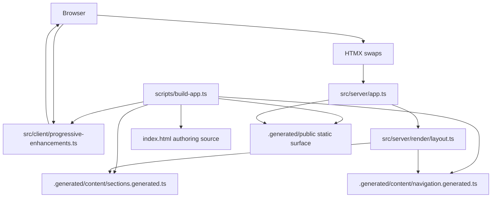

# VERTU Brand Guide

SSR-first VERTU brand guide built on Bun, Elysia, HTMX, Tailwind CSS 4, and daisyUI 5. The app renders a branded full-screen cover plus a server-owned guide shell, with browser JavaScript limited to progressive enhancement such as HTMX runtime boot, syntax highlighting, focus management, clipboard actions, and canvas exports through a single compiled client asset. Section markup is precompiled per language during the build so the server reads typed fragments instead of re-localizing legacy HTML on every request.

## Current stack

| Layer              | Technology                                                                    |
| ------------------ | ----------------------------------------------------------------------------- |
| Runtime            | Bun 1.3                                                                       |
| Server             | Elysia                                                                        |
| Rendering          | SSR HTML + HTMX fragment swaps                                                |
| Styling            | Tailwind CSS 4 build + daisyUI 5 plugin + imported guide overrides            |
| Client enhancement | Bundled HTMX, Prism, and progressive enhancement served as `/assets/guide.js` |
| Templates          | `pptxgenjs` + `docx`                                                          |
| Testing            | `bun run test`                                                                |

## Architecture



## View state

- `section`, `lang`, and `theme` are URL-owned state.
- `GET /` returns the full SSR document.
- `GET /` with `HX-Request: true` returns either `#guide-page` or `#guide-shell` based on `HX-Target`.
- `GET /` with `HX-History-Restore-Request: true` returns a full document and the response varies on HTMX request headers.
- `#guide-page` owns the branded cover, request indicator, toast container, scroll progress bar, and the top-level language/theme state.
- `#guide-shell` owns section navigation, sidebar state, main-region focus, and section-only swaps.
- Sidebar navigation uses `hx-boost` and swaps `#guide-shell`, while language/theme controls swap `#guide-page` so the cover and shell update together.
- Global controls use `hx-sync="#guide-page:replace"` and section links use `hx-sync="#guide-shell:replace"` so stale requests are replaced instead of racing.
- HTMX requests share a single daisyUI-backed request indicator and disabled-element contract so loading state is visible without custom request spinners in JavaScript.
- `#guide-page` is marked with `hx-history-elt` so HTMX snapshots the branded page wrapper instead of the entire body.
- During HTMX navigation, the page, shell, and main region expose `aria-busy`, then the browser layer restores focus to the main region and keeps section swaps aligned to the top of the guide stage instead of the cover.
- Invalid sections return HTTP `404` and fall back to `s0` with an in-page alert.

## Server entrypoints

| Entrypoint            | Default port | Purpose                                                    |
| --------------------- | ------------ | ---------------------------------------------------------- |
| `src/server/index.ts` | `3000`       | Development server started by `bun run dev`                |
| `src/server/serve.ts` | `3090`       | Typed static-preview entrypoint for built-asset validation |

Both entrypoints respect the `GUIDE_PORT` environment variable. `index.ts` also reads `PORT` and supports `-l`/`--listen` CLI flags.

## Repository layout

```text
src/
  client/
    progressive-enhancements.ts # Bundled HTMX + Prism runtime, clipboard, focus, playgrounds, canvas generators
    styles/
      guide.css             # Tailwind 4 + daisyUI entry for the compiled asset bundle
  server/
    app.ts                 # Elysia routes + official static plugin wiring
    index.ts               # Development server entrypoint (used by scripts/dev.ts)
    serve.ts               # Typed dedicated serve entrypoint for the local static-preview port
    runtime-config.ts      # Server-only filesystem paths for the generated runtime
    content/
      navigation.ts        # Canonical section navigation metadata
      source.ts            # Renders localized sections from the generated registry
    render/
      layout.ts            # SSR document, branded cover, and HTMX shell rendering
  shared/
    config.ts              # Public routes, download ids, and server runtime defaults
    guide-interactions.ts  # Typography playground and scroll-progress computation
    i18n.ts                # Shared bilingual copy
    legacy-guide.ts        # Bun HTMLRewriter-based authoring extraction and asset URL normalization
    logger.ts              # Structured logging
    markup.ts              # HTML label audits + markup text helpers
    section-markup.ts      # Build-time section localization and ARIA normalization
    shell-contract.ts      # Shared SSR/client/test DOM ids, selectors, and HTMX shell wiring
    view-state.ts          # URL state normalization

tests/
  app.test.ts
  accessibility.test.ts
  http-e2e.test.ts
  policy.test.ts

scripts/
  audit-brand-guide.ts     # SSR/accessibility/policy audit
  build-app.ts             # Builds assets, precompiled sections/navigation, and the bounded public surface
  dev.ts                   # Local boot orchestrator: initial build, filesystem watching, rebuild, and server restart
  generate-templates.mjs   # Generates canonical PPTX + DOCX source files

index.html                 # Migration source for section markup and guide prose
styles/brand-guide.css     # Existing visual system + SSR shell overrides
.generated/                # Build output: public assets + generated section registry
```

## Commands

```bash
bun run dev            # Full local boot: build → watch → serve on port 3000
bun run build          # Run build:templates then build:app
bun run build:app      # HTMLRewriter extraction, Tailwind/Bun bundling, public surface assembly
bun run serve          # Static-preview server on port 3090
bun run build:templates # Generate canonical PPTX + DOCX brand templates
bun run typecheck      # Run the TypeScript compiler in check-only mode
bun run test           # Run all tests including live HTTP smoke suite
bun run audit          # SSR, accessibility, and policy audit
bun run format         # Format source files with Prettier
bun run format:check   # Verify formatting without writing changes
```

## Environment variables

| Variable     | Default | Description                                  |
| ------------ | ------- | -------------------------------------------- |
| `GUIDE_PORT` | —       | Overrides the default port for either server |
| `PORT`       | —       | Fallback port read by `index.ts` only        |

## Notes

- `index.html` remains the authoring source for long-form section prose during the migration, but `bun run build:app` now uses Bun HTMLRewriter to extract sections deterministically and precompile localized sections and navigation into `.generated/content/` so the live server does direct lookups instead of mutating markup at request time.
- Authoring-time `data-i18n-text`, `data-i18n-alt`, and `data-i18n-aria` tokens in `index.html` are resolved during `bun run build:app`, so new localized section strings should be added to [`src/shared/i18n.ts`](/Users/brandondonnelly/Downloads/vertu-brand-guide/src/shared/i18n.ts) instead of request-time string replacement.
- `index.html` no longer owns language/theme bootstrap state; the live SSR route owns the branded cover plus shell contract and the download source stays on the default SSR state.
- Built CSS/JS assets and the bounded public surface are generated into `.generated/public/` by `bun run build:app`.
- `bun run dev` now owns the full local boot sequence: initial build, filesystem watching, rebuild orchestration, server watch mode, and cleanup on exit.
- The live server no longer exposes the repository root. Only files copied into `.generated/public/` are web-accessible.
- HTMX and Prism now ship inside the compiled client and stylesheet bundles instead of separate vendored browser assets.
- New user-facing strings should be added to [`src/shared/i18n.ts`](/Users/brandondonnelly/Downloads/vertu-brand-guide/src/shared/i18n.ts).
- Maintained source is expected to avoid `console.*` usage and `try/catch` blocks.
- The audit covers SSR output, HTMX fragment behavior, history restoration, centralized shell selectors, compiled asset delivery, public-surface isolation, explicit ARIA labels on interactive controls, parity markers for interactive sections, Tailwind source scanning, and the code-quality policy above.
- `bun run test` includes a live HTTP smoke suite that exercises the app over an ephemeral port instead of relying only on direct `app.handle()` calls.
