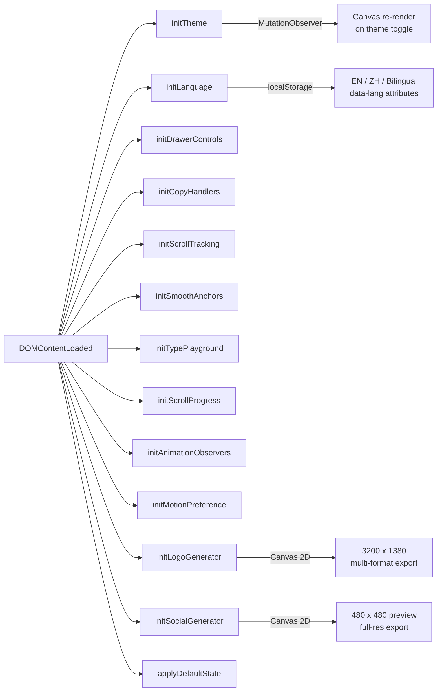
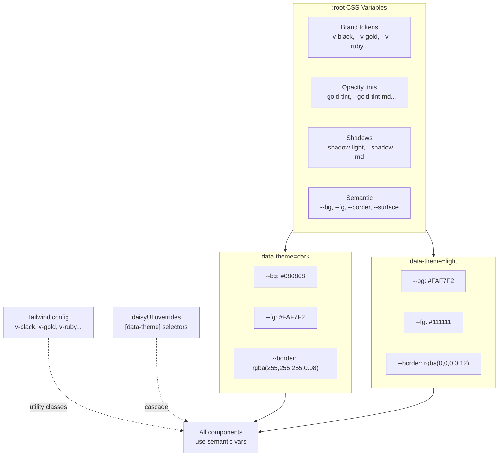
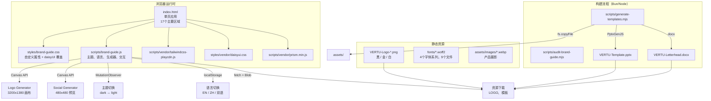
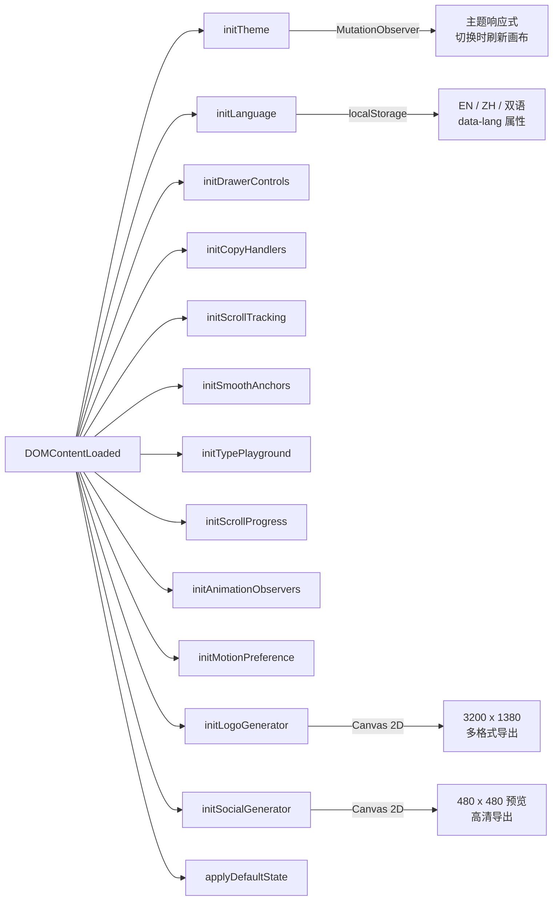
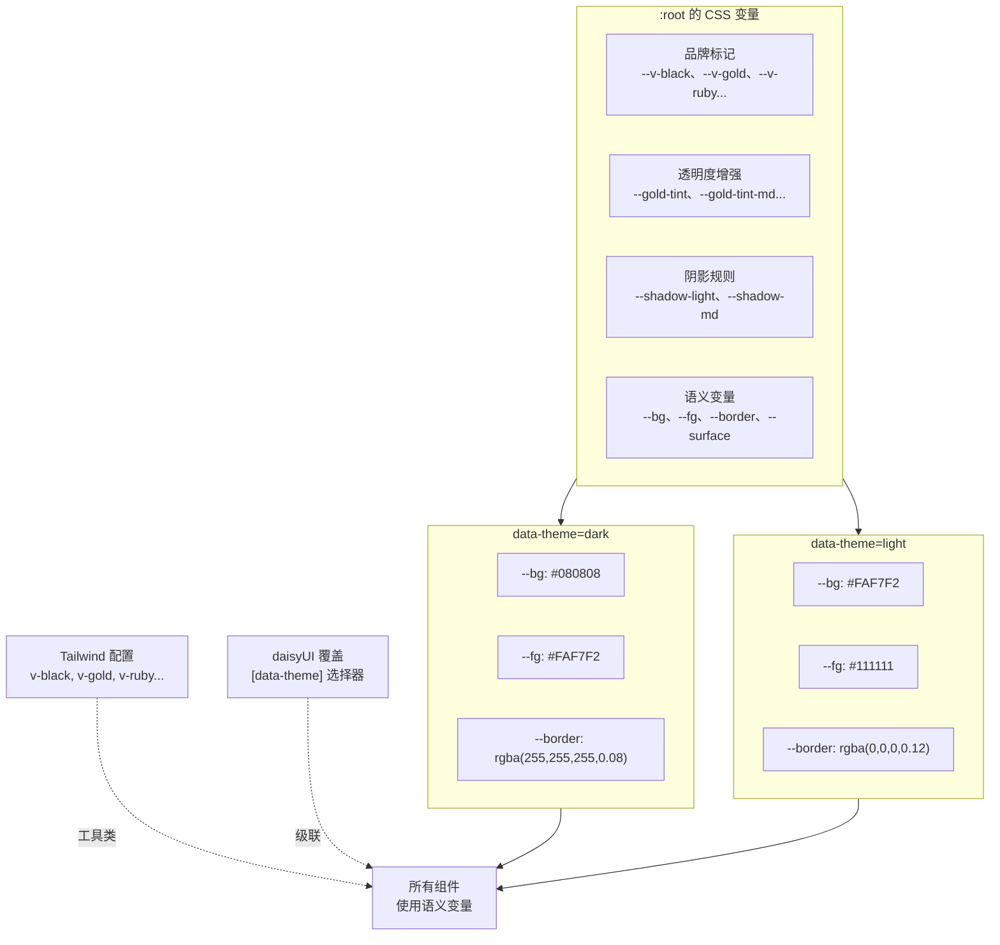

# VERTU Brand Guide

Interactive bilingual (EN/ZH) brand guideline system for VERTU England. Single-page application with dark/light theming, live canvas generators, downloadable templates, and code snippets.

## Language / Language

- English (EN): read from top to bottom
- 中文（CHN）：向下阅读至「中文文档」部分

## English Documentation

### Tech Stack

| Layer               | Technology                                                                     |
| ------------------- | ------------------------------------------------------------------------------ |
| Layout              | Tailwind CSS 3 (Play CDN, locally vendored)                                    |
| Components          | daisyUI 5 (locally vendored CSS)                                               |
| Syntax Highlighting | Prism.js (locally vendored)                                                    |
| Fonts               | Self-hosted WOFF2 (Playfair Display, DM Sans, IBM Plex Mono, Instrument Serif) |
| Template Generation | PptxGenJS 4 + docx 9 (Node/Bun)                                                |
| Runtime             | Vanilla JS (ES2022, no framework)                                              |
| Dev Server          | Python 3 `http.server` or any static server                                    |

### Architecture

```mermaid
graph TD
    subgraph Browser["Browser Runtime"]
        HTML["index.html<br/>Single-page app<br/>17 sections, bilingual"]
        CSS["styles/brand-guide.css<br/>Custom properties + daisyUI overrides"]
        JS["scripts/brand-guide.js<br/>Theme, i18n, generators, interactions"]
        TW["scripts/vendor/tailwindcss-playcdn.js"]
        DUI["styles/vendor/daisyui.css"]
        PRISM["scripts/vendor/prism.min.js"]
    end

    subgraph Build["Build Pipeline (Bun/Node)"]
        GEN["scripts/generate-templates.mjs"]
        AUDIT["scripts/audit-brand-guide.mjs"]
        PPTX["VERTU-Template.pptx"]
        DOCX["VERTU-Letterhead.docx"]
    end

    subgraph Assets["Static Assets"]
        LOGOS["VERTU-Logo-*.png<br/>Black / Gold / White"]
        FONTS["fonts/*.woff2<br/>4 families, 9 files"]
        IMAGES["assets/images/*.webp<br/>Product photography"]
    end

    HTML --> CSS
    HTML --> JS
    HTML --> TW
    HTML --> DUI
    HTML --> PRISM
    JS -->|Canvas API| LOGO_GEN["Logo Generator<br/>3200x1380 canvas"]
    JS -->|Canvas API| SOCIAL_GEN["Social Generator<br/>480x480 preview"]
    JS -->|MutationObserver| THEME["Theme Toggle<br/>dark ↔ light"]
    JS -->|localStorage| I18N["Language Switch<br/>EN / ZH / Bilingual"]
    JS -->|fetch + Blob| DOWNLOADS["Asset Downloads<br/>logos, templates"]
    GEN -->|PptxGenJS| PPTX
    GEN -->|docx| DOCX
    GEN -->|fs.copyFile| ASSETS_DIR["assets/"]
    LOGOS --> DOWNLOADS
    PPTX --> DOWNLOADS
    DOCX --> DOWNLOADS
```



### File Structure

```
vertu-brand-guide/
├── index.html                  # Single-page app (17 guide sections)
├── package.json                # v4.0.0, bun scripts
├── .gitignore
│
├── styles/
│   ├── brand-guide.css         # Custom properties, theme overrides, components
│   └── vendor/
│       ├── daisyui.css         # daisyUI 5 (local copy)
│       └── prism-tomorrow.min.css
│
├── scripts/
│   ├── brand-guide.js          # Main runtime (~2100 lines)
│   ├── generate-templates.mjs  # PPTX + DOCX builder (Bun/Node)
│   ├── audit-brand-guide.mjs   # Lint/audit utility
│   └── vendor/
│       ├── tailwindcss-playcdn.js
│       ├── prism.min.js
│       ├── prism-css.min.js
│       └── prism-javascript.min.js
│
├── fonts/                      # Self-hosted WOFF2
│   ├── playfair-display-*.woff2
│   ├── dm-sans-latin-variable.woff2
│   ├── ibm-plex-mono-*.woff2
│   └── instrument-serif-*.woff2
│
├── assets/
│   ├── VERTU-Template.pptx     # Generated presentation
│   ├── VERTU-Letterhead.docx   # Generated letterhead
│   └── images/                 # Product photography (WebP)
│
├── VERTU-Logo-Black.png        # Logo variants (root level)
├── VERTU-Logo-Gold.png
├── VERTU-Logo-White.png
├── VERTU-Template.pptx         # Root copy for direct download
└── VERTU-Letterhead.docx       # Root copy for direct download
```

### Guide Sections

| #   | Section               | Description                                     |
| --- | --------------------- | ----------------------------------------------- |
| 0   | Brand Guide           | Hero / introduction                             |
| 1   | Brand Essence         | Mission, heritage, values                       |
| 2   | Logo System           | Wordmark rules, clear space, variants           |
| 3   | Colour Palette        | Primary, accent, neutral swatches with hex copy |
| 4   | Pantone & Print       | Spot colour references for physical media       |
| 5   | Typography            | Type specimens, interactive playground          |
| 6   | Photography & Imagery | Art direction, hover labels                     |
| 7   | Tone of Voice         | Writing principles, do/don't examples           |
| 8   | Motion & Animation    | Easing tokens, interactive demos                |
| 9   | Spacing & Grid        | 8px base unit system                            |
| 10  | Digital Components    | Buttons, cards, interactive patterns            |
| 11  | Accessibility         | WCAG 2.2 AA contrast requirements               |
| 12  | Usage Guidelines      | Do/don't rules for brand application            |
| 13  | Image Guidelines      | Specs for digital and print image assets        |
| 14  | Code Snippets         | Copy-ready CSS/JS implementation code           |
| 15  | Downloads & Assets    | Logo PNGs, PPTX template, DOCX letterhead       |
| 16  | Agentic AI & LLM      | Context crumbs for AI coding agents             |

### JavaScript Modules

`brand-guide.js` is organized into init functions called from a single `DOMContentLoaded` entry point:



### Theming System

CSS custom properties are defined in `:root` and toggled via `data-theme="dark|light"` on `<html>`:



### NPM Scripts

```bash
# Generate PPTX + DOCX templates and copy to assets/
bun run build:templates

# Run HTML/CSS/JS audit checks
bun run audit

# Format script sources and docs
bun run format

# Check formatting without writing changes
bun run format:check

# Build templates then start dev server on :3090
bun run serve
```

#### Formatting Policy

All code and documentation changes should go through Prettier before commit:

```bash
bun run format
```

Use `bun run format:check` in CI or pre-push hooks to fail if formatting drifts.

### Template Generation

`generate-templates.mjs` produces two files:

**VERTU-Template.pptx** — 16:9 presentation (3 slides)

- Cover slide with gold rule divider
- Content slide with brand guidelines
- Closing slide with tagline
- Uses system-safe fonts (Georgia, Calibri, Consolas) with `autoFit`

**VERTU-Letterhead.docx** — A4 letterhead

- Gold header rule, VERTU wordmark
- Contact details footer
- System-safe fonts for cross-platform compatibility

### Key Conventions

- **No build step for the frontend** — all vendored locally, served as static files
- **Bilingual by default** — all visible text has `data-lang-en` and `data-lang-cn` spans
- **CSS variable cascade** — brand tokens in `:root` → semantic vars per theme → components consume semantic vars
- **daisyUI + Tailwind override pattern** — `[data-theme]` attribute selectors needed for specificity over daisyUI defaults
- **Canvas generators** — shared `renderSocialToCtx()` handles both preview (480px) and full-res export, re-renders on theme toggle via `MutationObserver`
- **Asset downloads** — `fetch()` + `Blob` + `URL.createObjectURL()` pattern, with `HEAD` probe to verify file availability before download

## 中文文档

### 技术栈

| 层级 | 技术 |
| ---- | ---- |
| 页面布局 | Tailwind CSS 3（Play CDN，本地托管） |
| 组件 | daisyUI 5（本地托管 CSS） |
| 语法高亮 | Prism.js（本地托管） |
| 字体 | 自助服务 WOFF2（Playfair Display、DM Sans、IBM Plex Mono、Instrument Serif） |
| 模板生成 | PptxGenJS 4 + docx 9（Node/Bun） |
| 运行时 | Vanilla JS（ES2022，无框架） |
| 开发服务器 | Python 3 `http.server` 或任意静态服务器 |

### 架构



### 文件结构

```
vertu-brand-guide/
├── index.html                  # 单页应用（17个部分）
├── package.json                # v4.0.0，bun scripts
├── .gitignore
│
├── styles/
│   ├── brand-guide.css         # 自定义变量、主题覆盖、组件
│   └── vendor/
│       ├── daisyui.css         # daisyUI 5（本地副本）
│       └── prism-tomorrow.min.css
│
├── scripts/
│   ├── brand-guide.js          # 主运行时（约2100行）
│   ├── generate-templates.mjs  # PPTX + DOCX 构建（Bun/Node）
│   ├── audit-brand-guide.mjs   # 检查/审计工具
│   └── vendor/
│       ├── tailwindcss-playcdn.js
│       ├── prism.min.js
│       ├── prism-css.min.js
│       └── prism-javascript.min.js
│
├── fonts/                      # 自托管 WOFF2
│   ├── playfair-display-*.woff2
│   ├── dm-sans-latin-variable.woff2
│   ├── ibm-plex-mono-*.woff2
│   └── instrument-serif-*.woff2
│
├── assets/
│   ├── VERTU-Template.pptx     # 生成后的模板
│   ├── VERTU-Letterhead.docx   # 生成的信头
│   └── images/                 # 产品摄影（WebP）
│
├── VERTU-Logo-Black.png        # 根目录 logo 变体
├── VERTU-Logo-Gold.png
├── VERTU-Logo-White.png
├── VERTU-Template.pptx         # 根目录直接下载副本
└── VERTU-Letterhead.docx       # 根目录直接下载副本
```

### 指南章节

| # | 章节 | 描述 |
| - | ---- | ---- |
| 0 | 品牌指南 | Hero 和引言 |
| 1 | 品牌本质 | 使命、传承、价值 |
| 2 | 标志系统 | 文字标识规则、留白、变体 |
| 3 | 颜色色板 | 主色、辅助色、中性色及十六进制说明 |
| 4 | Pantone 与印刷 | 物理媒体色彩引用 |
| 5 | 字体排版 | 字体样本、交互练习区 |
| 6 | 摄影与图像 | 视觉风格、悬停标签 |
| 7 | 语言风格 | 写作原则、正反示例 |
| 8 | 动效与动画 | 缓动参数、交互演示 |
| 9 | 间距与网格 | 8px 基础单位系统 |
| 10 | 数字组件 | 按钮、卡片、交互模式 |
| 11 | 可访问性 | WCAG 2.2 AA 对比要求 |
| 12 | 使用指引 | 品牌应用的正反规则 |
| 13 | 图片规范 | 数字与印刷素材规格 |
| 14 | 代码片段 | 可复制的 CSS/JS 实现 |
| 15 | 下载与资源 | Logo PNG、PPTX 模板、DOCX 信头 |
| 16 | AI 与 LLM 助手 | 为 AI 编码助手提供语境 |

### JavaScript 模块

`brand-guide.js` 被组织为多个初始化函数，统一从一个 `DOMContentLoaded` 入口触发：



### 主题系统

CSS 变量在 `:root` 中定义，通过 `<html>` 上的 `data-theme="dark|light"` 切换：



### NPM 脚本

```bash
# 生成 PPTX + DOCX 模板并同步到 assets/
bun run build:templates

# 运行 HTML/CSS/JS 检查
bun run audit

# 格式化脚本和文档
bun run format

# 检查格式不变
bun run format:check

# 生成模板后启动开发服务，默认端口 3090
bun run serve
```

#### 格式化规范

建议所有代码和文档变更提交前通过 Prettier 处理：

```bash
bun run format
```

在 CI 或 pre-push hook 中使用 `bun run format:check`，以防格式漂移。

### 模板生成

`generate-templates.mjs` 会生成两个文件：

**VERTU-Template.pptx** — 16:9 模板（3 页）

- 封面页含金色分割线
- 内容页说明品牌规范
- 尾页展示口号
- 使用系统安全字体（Georgia、Calibri、Consolas）并启用 `autoFit`

**VERTU-Letterhead.docx** — A4 信头

- 金色顶部规则线和 VERTU 字标
- 联系信息页脚
- 使用系统安全字体，兼容跨平台展示

### 关键约定

- **前端无构建步骤** — 所有依赖本地化并以静态方式提供
- **默认双语** — 所有可见文本均包含 `data-lang-en` 和 `data-lang-cn`
- **CSS 变量层级** — 品牌 token → 语义变量 → 组件消费
- **daisyUI + Tailwind 覆盖模式** — 需要 `[data-theme]` 选择器提高特异性
- **Canvas 生成器** — 共享 `renderSocialToCtx()` 处理 480px 预览和高分辨率导出，并在主题切换时通过 `MutationObserver` 重绘
- **资源下载** — 采用 `fetch()` + `Blob` + `URL.createObjectURL()`，并通过 `HEAD` 检查确认文件可访问
