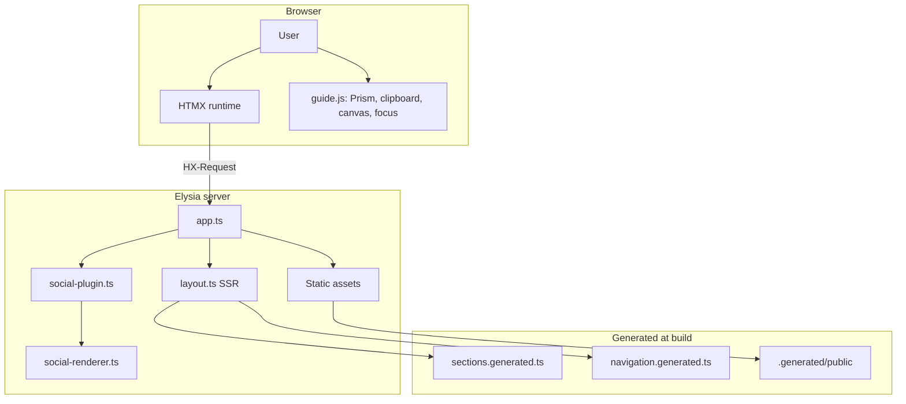
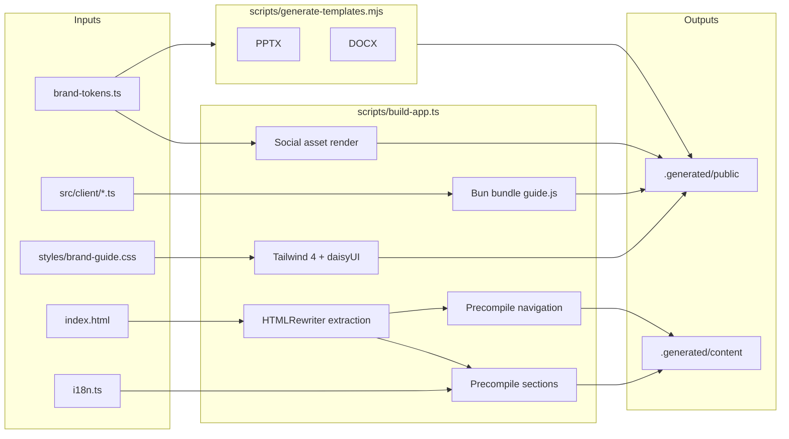
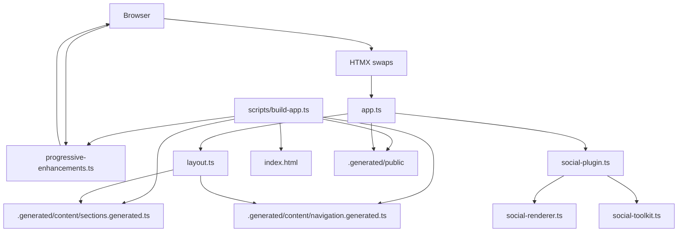

# VERTU Brand Guide

[](https://bun.sh)
[](https://elysiajs.com)
[](https://www.typescriptlang.org/)
[](https://htmx.org)
[](https://tailwindcss.com)
[](https://bun.sh)
[](https://biomejs.dev)
[](https://prettier.io)

SSR-first VERTU brand guide built on Bun, Elysia, HTMX, Tailwind CSS 4, and daisyUI 5. The app renders a branded full-screen cover plus a server-owned guide shell, with browser JavaScript limited to progressive enhancement such as HTMX runtime boot, syntax highlighting, focus management, clipboard actions, and canvas exports through a single compiled client asset. Section markup is precompiled per language during the build so the server reads typed fragments instead of re-localizing authoring HTML on every request. Generated document templates, social-renderer palettes, and the downloadable HTML guide snapshot share typed release metadata and brand tokens with the UI so the build pipeline and runtime stay aligned, and unchanged canonical social outputs are fingerprint-reused across verification runs instead of being rerendered on every cycle.

**Languages:** [English](README.md) · [中文](README.zh-CN.md)

## Stack

| Layer              | Technology                                                                    |
| ------------------ | ----------------------------------------------------------------------------- |
| Runtime            | Bun 1.3                                                                       |
| Server             | Elysia                                                                        |
| Rendering          | SSR HTML + HTMX fragment swaps                                                |
| Styling            | Tailwind CSS 4 build + daisyUI 5 plugin + imported guide overrides            |
| Client enhancement | Bundled HTMX, Prism, and progressive enhancement served as `/assets/guide.js` |
| Templates          | `pptxgenjs` + `docx`                                                          |
| Testing            | `bun run test`                                                                |

## Architecture

### Request flow



### Build pipeline



### Component relationships



## Social toolkit surfaces

- `GET /social/:preset.png` renders a bounded PNG asset from preset-driven inputs.
- `GET /social/carousel/:preset/:frame.png` renders preset-bounded carousel frames.
- `GET /social/packs/:packId` returns the typed JSON pack manifest only.
- `GET /social/preview` returns the HTMX preview fragment markup for the operator panel.
- Canonical build assets are emitted under `.generated/public/assets/social/`.
- Canonical build manifests are emitted under `.generated/public/assets/social/manifests/`.

## View state

- `section`, `lang`, and `theme` are URL-owned state.
- `GET /` returns the full SSR document.
- `GET /` with `HX-Request: true` returns either `#guide-page` or `#guide-shell` based on `HX-Target`.
- `GET /` with `HX-History-Restore-Request: true` returns a full document and the response varies on HTMX request headers.
- `#guide-page` owns the branded cover, request indicator, toast container, scroll progress bar, and the top-level language/theme state.
- `#guide-shell` owns section navigation, sidebar state, main-region focus, and section-only swaps.
- Sidebar navigation uses `hx-boost` and swaps `#guide-shell`, while language/theme controls swap `#guide-page` so the cover and shell update together.
- Global controls use `hx-sync="#guide-page:replace"` and section links use `hx-sync="#guide-shell:replace"` so stale requests are replaced instead of racing.
- HTMX requests share a single daisyUI-backed request indicator and disabled-element contract so loading state is visible without custom request spinners in JavaScript.
- `#guide-page` is marked with `hx-history-elt` so HTMX snapshots the branded page wrapper instead of the entire body.
- During HTMX navigation, the page, shell, and main region expose `aria-busy`, then the browser layer restores focus to the main region and keeps section swaps aligned to the top of the guide stage instead of the cover.
- Invalid sections return HTTP `404` and fall back to `s0` with an in-page alert.
- Guide-owned SSR, download, and social toolkit responses include a correlation id header, and request completion/error events are emitted through the shared structured logger.

## Server entrypoints

| Entrypoint            | Default port | Purpose                                                    |
| --------------------- | ------------ | ---------------------------------------------------------- |
| `src/server/index.ts` | `3000`       | Development server started by `bun run dev`                |
| `src/server/serve.ts` | `3090`       | Typed static-preview entrypoint for built-asset validation |

Both entrypoints use one shared port-resolution contract from `runtime-config.ts`, one shared boot contract from `src/server/boot.ts`, and shared defaults from `src/shared/runtime-settings.ts`. They respect `GUIDE_PORT`, also fall back to `PORT` for container platforms like Railway, and support `-l`/`--listen` CLI flags.

## Repository layout

```text
src/
  client/
    logo-generator.ts      # Canvas logo export enhancement
    progressive-enhancements.ts # Bundled HTMX + Prism runtime, clipboard, focus, playgrounds, canvas generators
    social-toolkit.ts      # Social toolkit form normalization and bounded option sync
    styles/
      guide.css             # Tailwind 4 + daisyUI entry for the compiled asset bundle
  server/
    app.ts                 # Elysia routes + official static plugin wiring
    boot.ts                # Shared boot contract for dev and serve entrypoints
    index.ts               # Development server entrypoint (used by scripts/dev.ts)
    observability-plugin.ts # Shared request-id propagation and structured request logging
    serve.ts               # Typed dedicated serve entrypoint for the local static-preview port
    social-plugin.ts       # Elysia plugin for social render + preview + pack routes
    social-renderer.ts     # Satori + Resvg renderer and preview-model helpers using shared brand tokens
    runtime-config.ts      # Server-only filesystem paths + shared port resolver using Bun-native module-relative paths
    content/
      generated.ts         # Re-exports generated section and navigation registries
      navigation.ts        # Canonical section navigation metadata
      source.ts            # Renders localized sections from the generated registry
    render/
      layout.ts            # SSR document, branded cover, and HTMX shell rendering
  shared/
    asset-operator-contract.ts # Shared DOM ids for download/logo/social toolkit markup and tests
    authoring-guide.ts     # Bun HTMLRewriter-based authoring extraction and asset URL normalization
    brand-tokens.ts        # Shared brand palette, font families, and social theme tokens
    config.ts              # Public routes, download ids, and server runtime defaults
    guide-interactions.ts  # Typography playground and scroll-progress computation
    htmx-event-contract.ts # Typed HTMX browser event names, detail payloads, and target resolution
    i18n.ts                # Shared bilingual copy
    logger.ts              # Structured logging
    markup.ts              # HTML label audits + markup text helpers
    repository-policy.ts   # Filesystem and AST policy checks for audits
    runtime-settings.ts    # Typed shared runtime defaults, env parsing, and warning logging
    section-markup.ts      # Build-time section localization and ARIA normalization
    shell-contract.ts      # Shared SSR/client/test DOM ids, selectors, and HTMX shell wiring
    social-toolkit.ts      # Social preset registry, contracts, request normalization, and manifest builders
    template-catalog.ts    # Shared release metadata and generated template registry
    template-markup.ts     # Server-owned template library cards for the downloads section
    view-state.ts          # URL state normalization

tests/
  accessibility.test.ts
  app.test.ts
  http-e2e.test.ts
  policy.test.ts
  social-toolkit.test.ts

scripts/
  audit-brand-guide.ts     # SSR/accessibility/policy audit
  build-app.ts             # Builds assets, precompiled sections/navigation, and the bounded public surface
  dev.ts                   # Local boot orchestrator: initial build, filesystem watching, rebuild, and server restart
  generate-templates.mjs   # Generates canonical PPTX + DOCX source files from shared catalog + brand tokens

index.html                 # Authoring source for section markup and guide prose
styles/brand-guide.css     # Visual system + SSR shell overrides
.generated/                # Build output: public assets + generated section registry
```

## Commands

```bash
bun run dev            # Full local boot: build → watch → serve on port 3000
bun run build          # Run build:templates then build:app
bun run build:app      # HTMLRewriter extraction, Tailwind/Bun bundling, public surface assembly
bun run lint           # Run Biome across TypeScript, CSS, JSON, and authored HTML surfaces
bun run serve          # Static-preview server on port 3090
bun run build:templates # Generate canonical PPTX + DOCX brand templates
bun run typecheck      # Run the TypeScript compiler in check-only mode
bun run test           # Run all tests including live HTTP smoke suite
bun run audit          # SSR, accessibility, and policy audit
bun run format         # Format source files with Prettier
bun run format:check   # Verify formatting without writing changes
```

## Railway / Railpack

- `railway.json` pins Railway to the `RAILPACK` builder for services created before Railpack became the default builder.
- Railway uses Railpack zero-config for this repo: it detects Bun from `package.json`, runs `bun run build`, and starts from the `start` script in `package.json`.
- When Railway injects `PORT`, the server automatically binds to `0.0.0.0`; `GUIDE_HOST` still overrides that when explicitly set.

## Environment variables

| Variable                    | Default | Description                                                                    |
| --------------------------- | ------- | ------------------------------------------------------------------------------ |
| `GUIDE_HOST`                | `localhost` | Shared listen hostname and canonical local origin host; container fallback is `0.0.0.0` when `PORT` is present |
| `GUIDE_DEFAULT_PORT`        | `3000`  | Default development server port before `GUIDE_PORT` / CLI overrides            |
| `GUIDE_SERVE_PORT`          | `3090`  | Default static-preview port before `GUIDE_PORT` overrides                      |
| `GUIDE_PORT`                | —       | Overrides the default port for either server                                   |
| `PORT`                      | —       | Railway/container port that also switches the default bind host to `0.0.0.0`       |
| `GUIDE_REQUEST_ID_HEADER`   | `x-request-id` | Response/request correlation header name                                 |
| `GUIDE_STATIC_ASSET_MAX_AGE_SECONDS` | `3600` | Max-age for compiled CSS/JS and copied public assets                   |
| `GUIDE_STATIC_ASSET_STALE_WHILE_REVALIDATE_SECONDS` | `86400` | SWR window for compiled CSS/JS and copied public assets |
| `GUIDE_MANIFEST_MAX_AGE_SECONDS` | `3600` | Max-age for generated social manifests                                   |
| `GUIDE_MANIFEST_STALE_WHILE_REVALIDATE_SECONDS` | `86400` | SWR window for generated social manifests           |
| `GUIDE_SOCIAL_ASSET_MAX_AGE_SECONDS` | `86400` | Max-age for rendered social PNG assets                                  |
| `GUIDE_SOCIAL_ASSET_STALE_WHILE_REVALIDATE_SECONDS` | `604800` | SWR window for rendered social PNG assets      |
| `GUIDE_DEV_BUILD_DEBOUNCE_MS` | `150` | Filesystem event debounce window for `bun run dev`                            |
| `GUIDE_DEV_WATCHER_WARMUP_MS` | `1000` | Watcher warmup window after boot/rebuild                                     |
| `VERTU_TEMPLATE_SAFE_FONTS` | —       | Set to `1` to use system-safe fonts in PPTX/DOCX generation (avoids embedding) |

Copy [`.env.example`](.env.example) to `.env` or `.env.local` and adjust as needed. Never commit `.env` or `.env.local` — they are gitignored.

## Dot files and .gitignore

| File / pattern   | Purpose                                                                  |
| ---------------- | ------------------------------------------------------------------------ |
| `.env.example`   | Template for environment variables; safe to commit. Copy to `.env`.      |
| `.env`, `.env.*` | Local overrides and secrets; **never commit**. Gitignored.               |
| `.gitignore`     | Excludes build output, dependencies, logs, IDE artifacts, and env files. |

Best practices:

- Use `.env.example` to document required or optional variables.
- Keep `.env` and `.env.local` out of version control.
- Add project-specific build artifacts (e.g. `.generated/`, `preview_slide_*.png`) to `.gitignore`.

## Notes

- `index.html` is the authoring source for long-form section prose. `bun run build:app` uses Bun HTMLRewriter to extract sections deterministically and precompile localized sections and navigation into `.generated/content/` so the live server does direct lookups instead of mutating markup at request time.
- Authoring-time `data-i18n-text`, `data-i18n-alt`, and `data-i18n-aria` tokens in `index.html` are resolved during `bun run build:app`. New localized section strings should be added to [`src/shared/i18n.ts`](src/shared/i18n.ts).
- The live SSR route owns language/theme bootstrap state and the branded cover plus shell contract.
- The downloadable HTML guide is generated from the live SSR route during `bun run build`, so saved guide snapshots stay aligned with the current cover, sidebar, and request-state shell.
- Built CSS/JS assets and the bounded public surface are generated into `.generated/public/` by `bun run build:app`.
- Canonical social PNGs and pack manifests are fingerprinted during `bun run build:app`; when renderer inputs are unchanged, the build reuses the previous `.generated/public/assets/social/` output instead of rerendering the full matrix.
- Shared path resolution in `src/server/runtime-config.ts` drives both canonical and staging build output, so `scripts/build-app.ts` delegates `.generated` path computation to the shared contract.
- Brand-owned files, local font files, full-build triggers, and social fingerprint inputs are resolved from the same runtime-config contract, keeping project-root-dependent paths out of ad hoc script logic.
- Runtime defaults, cache headers, dev watcher timing, and request-id propagation are defined in `src/shared/runtime-settings.ts` so server entrypoints and scripts share one source of truth.
- Bun command arrays for server launch, `bun run` build targets, and Tailwind compilation are defined in `src/server/runtime-config.ts`, while `src/server/boot.ts` owns the dev-vs-serve boot split.
- Social toolkit PNG, manifest, preview, redirect, and invalid-envelope responses are built through one typed header/ETag contract inside `src/server/social-plugin.ts`.
- `social-renderer.ts` resolves all font family names and accent colors from `GUIDE_BRAND_FONT_FAMILIES` and `GUIDE_BRAND_COLOR_TOKENS` in `brand-tokens.ts`; asset-specific accent mapping lives in a local `ASSET_ACCENT_COLORS` constant that references the shared tokens.
- `logo-generator.ts` derives its default background from `GUIDE_BRAND_COLOR_TOKENS.black`.
- `generate-templates.mjs` resolves all slide layout dimensions from named `PPTX.layout` and `PPTX.style` constants and routes its evidence-theme color through the shared `BRAND.colors` map so no raw hex values appear outside the token source of truth.
- PPTX slide content (menu cards, bento media placeholders, insight evidence blocks) is constrained within the 7.5″ slide height and the 6.85″ footer rule, preventing out-of-bounds overflow in generated presentations.

## AI Docs

- External stack references verified against [llms-stack-refresh](https://github.com/d4551/llms-stack-refresh).
- Recommended raw docs:
  - [Bun](https://raw.githubusercontent.com/d4551/llms-stack-refresh/main/bun/llms.txt)
  - [ElysiaJS](https://raw.githubusercontent.com/d4551/llms-stack-refresh/main/elysiajs/llms.txt)
  - [htmx](https://raw.githubusercontent.com/d4551/llms-stack-refresh/main/htmx/llms.txt)
  - [Tailwind CSS](https://raw.githubusercontent.com/d4551/llms-stack-refresh/main/tailwindcss/llms.txt)
  - [daisyUI](https://raw.githubusercontent.com/d4551/llms-stack-refresh/main/daisyui/llms.txt)
- Generated navigation and section imports flow through `src/server/content/generated.ts`, and public asset hrefs are resolved back to source files through a shared runtime-config helper.
- Approved social image paths use a shared `/assets/images` href helper from `src/shared/config.ts`.
- Approved social asset alt text, picker labels, display labels, and metadata live in the shared social registry so the form layer and renderer consume typed copy.
- The embedded downloads-section social form keeps authored defaults and preview-panel state through Bun `HTMLRewriter` transforms.
- Guide language/theme/section normalization and social preview-panel states resolve through shared typed helpers, so SSR, browser hydration, and social rendering share one set of fallback rules.
- `bun run dev` owns the full local boot sequence: initial full build, filesystem watching, app-only rebuilds for regular guide edits, full rebuilds when template/build-config inputs change, server watch mode, and cleanup on exit.
- The live server exposes only files copied into `.generated/public/`; the repository root is not web-accessible.
- HTMX and Prism ship inside the compiled client and stylesheet bundles.
- HTMX browser event names and `detail.target` resolution live in [`src/shared/htmx-event-contract.ts`](src/shared/htmx-event-contract.ts), so client enhancements use typed constants for swap/error lifecycle handling.
- New user-facing strings should be added to [`src/shared/i18n.ts`](src/shared/i18n.ts).
- Maintained source is expected to avoid `console.*` usage and `try/catch` blocks.
- The audit covers SSR output, HTMX fragment behavior, history restoration, centralized shell selectors, compiled asset delivery, public-surface isolation, explicit ARIA labels on interactive controls, parity markers for interactive sections, Tailwind source scanning, and the code-quality policy above.
- `bun run audit`, `bun run test`, and `bun run typecheck` lint before building so verification cannot bypass static analysis.
- `bun run test` includes a live HTTP smoke suite that exercises the app over an ephemeral port.
