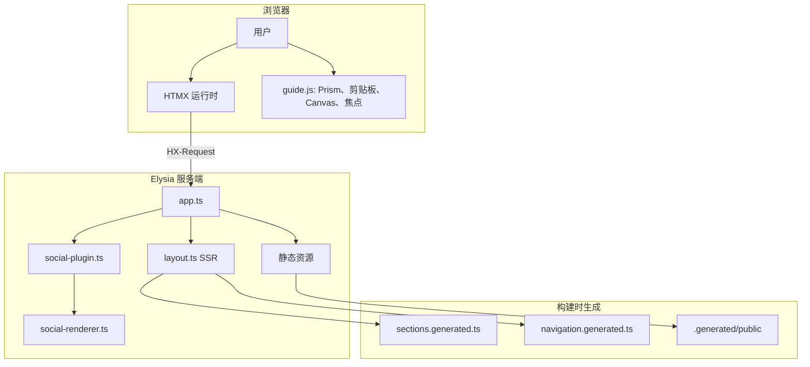
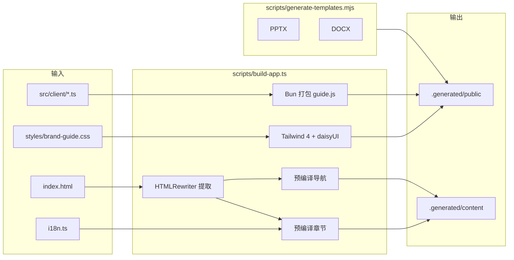
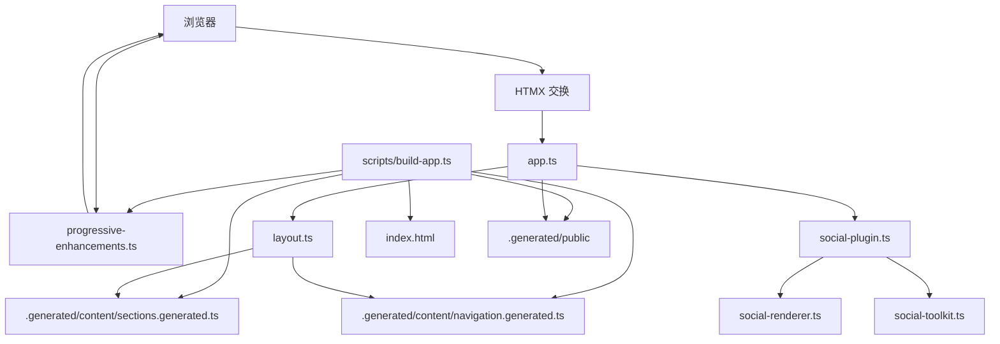

# VERTU 品牌指南

[](https://bun.sh)
[](https://elysiajs.com)
[](https://www.typescriptlang.org/)
[](https://htmx.org)
[](https://tailwindcss.com)
[](https://bun.sh)
[](https://prettier.io)

基于 Bun、Elysia、HTMX、Tailwind CSS 4 和 daisyUI 5 构建的 SSR 优先 VERTU 品牌指南。应用渲染品牌全屏封面与服务端持有的指南壳层，浏览器端 JavaScript 仅用于渐进增强（如 HTMX 运行时启动、语法高亮、焦点管理、剪贴板操作、Canvas 导出），通过单一编译客户端资源交付。章节标记在构建时按语言预编译，服务端直接读取类型化片段，无需在每次请求时重新本地化创作 HTML。生成的文档模板与可下载的 HTML 指南快照与 UI 共享类型化发布元数据，构建流水线与运行时保持一致。

**语言：** [English](README.md) · [中文](README.zh-CN.md)

## 技术栈

| 层级       | 技术                                                      |
| ---------- | --------------------------------------------------------- |
| 运行时     | Bun 1.3                                                   |
| 服务端     | Elysia                                                    |
| 渲染       | SSR HTML + HTMX 片段交换                                  |
| 样式       | Tailwind CSS 4 构建 + daisyUI 5 插件 + 导入的指南覆盖     |
| 客户端增强 | 打包的 HTMX、Prism 与渐进增强，以 `/assets/guide.js` 提供 |
| 模板       | `pptxgenjs` + `docx`                                      |
| 测试       | `bun run test`                                            |

## 架构

### 请求流程



### 构建流水线



### 组件关系



## 社交素材工具包接口

- `GET /social/:preset.png` 根据预设输入渲染有界 PNG 素材。
- `GET /social/carousel/:preset/:frame.png` 渲染预设有界的轮播帧。
- `GET /social/packs/:packId` 仅返回类型化 JSON 套件清单。
- `GET /social/preview` 返回操作面板的 HTMX 预览片段标记。
- 规范构建素材输出至 `.generated/public/assets/social/`。
- 规范构建清单输出至 `.generated/public/assets/social/manifests/`。

## 视图状态

- `section`、`lang`、`theme` 由 URL 持有。
- `GET /` 返回完整 SSR 文档。
- 带 `HX-Request: true` 的 `GET /` 根据 `HX-Target` 返回 `#guide-page` 或 `#guide-shell`。
- 带 `HX-History-Restore-Request: true` 的 `GET /` 返回完整文档，响应随 HTMX 请求头变化。
- `#guide-page` 持有品牌封面、请求指示器、Toast 容器、滚动进度条及顶层语言/主题状态。
- `#guide-shell` 持有章节导航、侧边栏状态、主区域焦点及仅章节交换。
- 侧边栏导航使用 `hx-boost` 并交换 `#guide-shell`，语言/主题控件交换 `#guide-page`，封面与壳层同步更新。
- 全局控件使用 `hx-sync="#guide-page:replace"`，章节链接使用 `hx-sync="#guide-shell:replace"`，以替换过期请求而非竞态。
- HTMX 请求共享单一 daisyUI 请求指示器与禁用元素契约，加载状态可见，无需自定义 JavaScript 请求动画。
- `#guide-page` 标记为 `hx-history-elt`，HTMX 快照品牌页面包装器而非整个 body。
- HTMX 导航期间，页面、壳层与主区域暴露 `aria-busy`，浏览器层恢复主区域焦点，章节交换与指南舞台顶部对齐而非封面。
- 无效章节返回 HTTP `404`，并回退至 `s0` 及页内提示。

## 服务入口

| 入口                  | 默认端口 | 用途                                 |
| --------------------- | -------- | ------------------------------------ |
| `src/server/index.ts` | `3000`   | 开发服务器，由 `bun run dev` 启动    |
| `src/server/serve.ts` | `3090`   | 类型化静态预览入口，用于构建资源验证 |

两个入口均遵循 `GUIDE_PORT` 环境变量。`index.ts` 还读取 `PORT` 并支持 `-l`/`--listen` CLI 参数。

## 仓库结构

```text
src/
  client/
    logo-generator.ts      # Canvas 标志导出增强
    progressive-enhancements.ts # 打包的 HTMX + Prism 运行时、剪贴板、焦点、演练场、Canvas 生成器
    social-toolkit.ts      # 社交工具包表单规范化与有界选项同步
    styles/
      guide.css             # Tailwind 4 + daisyUI 入口，用于编译资源包
  server/
    app.ts                 # Elysia 路由与官方静态插件配置
    index.ts               # 开发服务器入口（由 scripts/dev.ts 使用）
    serve.ts               # 类型化专用 serve 入口，用于本地静态预览端口
    social-plugin.ts       # Elysia 插件：社交渲染、预览、套件路由
    social-renderer.ts     # Satori + Resvg 渲染器与预览模型辅助
    runtime-config.ts      # 服务端专用生成运行时文件系统路径
    content/
      navigation.ts        # 规范章节导航元数据
      source.ts            # 从生成注册表渲染本地化章节
    render/
      layout.ts            # SSR 文档、品牌封面与 HTMX 壳层渲染
  shared/
    config.ts              # 公开路由、下载 ID、服务端运行时默认值
    guide-interactions.ts  # 排版演练场与滚动进度计算
    i18n.ts                # 共享双语文案
    template-catalog.ts    # 共享发布元数据与生成模板注册表
    template-markup.ts     # 服务端持有的下载区模板库卡片
    authoring-guide.ts     # Bun HTMLRewriter 创作提取与资源 URL 规范化
    logger.ts              # 结构化日志
    markup.ts              # HTML 标签审计与标记文本辅助
    section-markup.ts      # 构建时章节本地化与 ARIA 规范化
    shell-contract.ts      # 共享 SSR/客户端/测试 DOM ID、选择器与 HTMX 壳层配置
    social-toolkit.ts      # 社交预设注册表、契约、请求规范化与清单构建器
    view-state.ts          # URL 状态规范化

tests/
  app.test.ts
  accessibility.test.ts
  http-e2e.test.ts
  policy.test.ts

scripts/
  audit-brand-guide.ts     # SSR/无障碍/策略审计
  build-app.ts             # 构建资源、预编译章节/导航与有界公开表面
  dev.ts                   # 本地启动编排：初始构建、文件监听、重建、服务重启
  generate-templates.mjs   # 生成规范 PPTX + DOCX 源文件

index.html                 # 章节标记与指南正文的迁移源
styles/brand-guide.css     # 现有视觉系统 + SSR 壳层覆盖
.generated/                # 构建输出：公开资源 + 生成章节注册表
```

## 命令

```bash
bun run dev            # 完整本地启动：构建 → 监听 → 在端口 3000 提供服务
bun run build          # 先执行 build:templates 再执行 build:app
bun run build:app      # HTMLRewriter 提取、Tailwind/Bun 打包、公开表面组装
bun run serve          # 端口 3090 上的静态预览服务器
bun run build:templates # 生成规范 PPTX + DOCX 品牌模板
bun run typecheck      # 仅检查模式的 TypeScript 编译
bun run test           # 运行所有测试（含实时 HTTP 冒烟套件）
bun run audit          # SSR、无障碍与策略审计
bun run format         # 使用 Prettier 格式化源文件
bun run format:check   # 验证格式但不写入
```

## 环境变量

| 变量                        | 默认 | 说明                                                                 |
| --------------------------- | ---- | -------------------------------------------------------------------- |
| `GUIDE_PORT`                | —    | 覆盖任一服务器的默认端口                                             |
| `PORT`                      | —    | 仅由 `index.ts` 读取的备用端口                                       |
| `VERTU_TEMPLATE_SAFE_FONTS` | —    | 设为 `1` 时在 PPTX/DOCX 生成中使用系统安全字体（避免嵌入自定义字体） |

将 [`.env.example`](.env.example) 复制为 `.env` 或 `.env.local` 并按需调整。切勿提交 `.env` 或 `.env.local`，它们已被 gitignore。

## 点文件与 .gitignore

| 文件 / 模式      | 用途                                             |
| ---------------- | ------------------------------------------------ |
| `.env.example`   | 环境变量模板，可安全提交。复制为 `.env` 使用。   |
| `.env`、`.env.*` | 本地覆盖与密钥；**切勿提交**。已加入 gitignore。 |
| `.gitignore`     | 排除构建输出、依赖、日志、IDE 产物与环境文件。   |

最佳实践：

- 使用 `.env.example` 记录必需或可选变量。
- 将 `.env` 与 `.env.local` 排除在版本控制之外。
- 将项目特定构建产物（如 `.generated/`、`preview_slide_*.png`）加入 `.gitignore`。

## 说明

- `index.html` 是长篇章节正文的创作源，`bun run build:app` 使用 Bun HTMLRewriter 确定性提取章节，并将本地化章节与导航预编译至 `.generated/content/`，使运行服务器直接查找而非在请求时修改标记。
- `index.html` 中的创作时 `data-i18n-text`、`data-i18n-alt`、`data-i18n-aria` 标记在 `bun run build:app` 期间解析，新增本地化章节字符串应添加到 [`src/shared/i18n.ts`](src/shared/i18n.ts)，而非请求时字符串替换。
- `index.html` 不再持有语言/主题引导状态；运行中的 SSR 路由持有品牌封面与壳层契约。
- 可下载的 HTML 指南在 `bun run build` 期间由运行中的 SSR 路由生成，保存的指南快照与当前封面、侧边栏及请求状态壳层保持一致。
- 构建的 CSS/JS 资源与有界公开表面由 `bun run build:app` 生成至 `.generated/public/`。
- `bun run dev` 负责完整本地启动序列：初始构建、文件系统监听、重建编排、服务器监听模式及退出时清理。
- 运行中的服务器不再暴露仓库根目录，仅复制到 `.generated/public/` 的文件可被 Web 访问。
- HTMX 与 Prism 现打包在编译后的客户端与样式包中，而非单独的 vendored 浏览器资源。
- 新增面向用户的字符串应添加到 [`src/shared/i18n.ts`](src/shared/i18n.ts)。
- 维护中的源码应避免使用 `console.*` 与 `try/catch` 块。
- 审计涵盖 SSR 输出、HTMX 片段行为、历史恢复、集中壳层选择器、编译资源交付、公开表面隔离、交互控件的显式 ARIA 标签、交互章节的等价标记、Tailwind 源扫描及上述代码质量策略。
- `bun run test` 包含在临时端口上运行应用的实时 HTTP 冒烟套件，而非仅依赖直接 `app.handle()` 调用。
