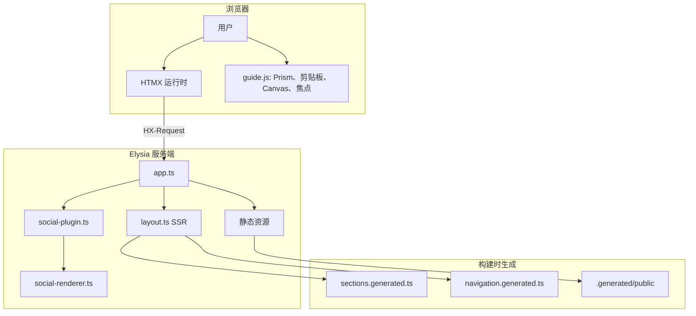
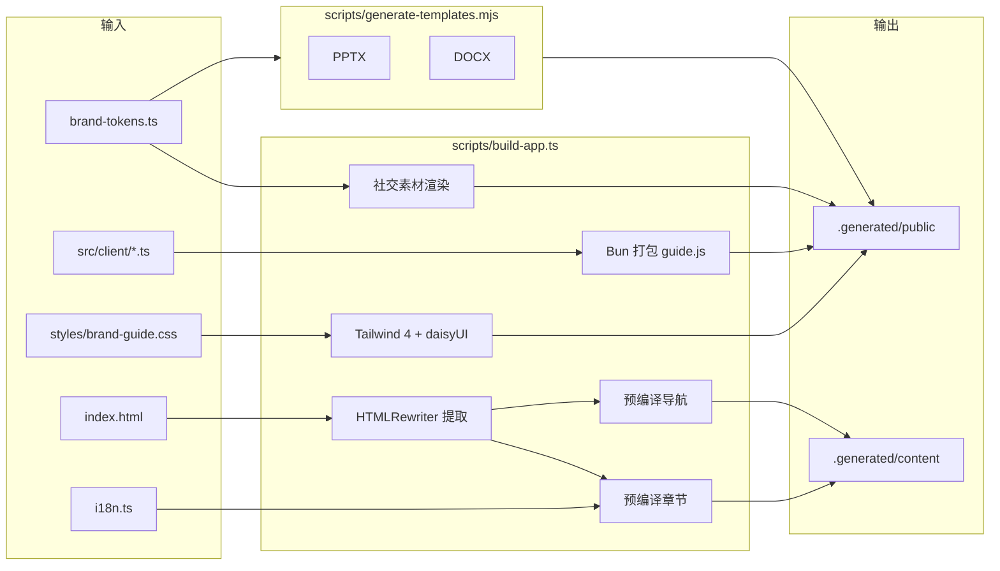
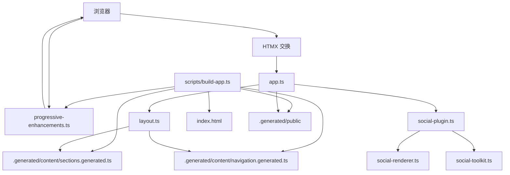

# VERTU 品牌指南

[](https://bun.sh)
[](https://elysiajs.com)
[](https://www.typescriptlang.org/)
[](https://htmx.org)
[](https://tailwindcss.com)
[](https://bun.sh)
[](https://biomejs.dev)
[](https://prettier.io)

基于 Bun、Elysia、HTMX、Tailwind CSS 4 和 daisyUI 5 构建的 SSR 优先 VERTU 品牌指南。应用渲染品牌全屏封面与服务端持有的指南壳层，浏览器端 JavaScript 仅用于渐进增强（如 HTMX 运行时启动、语法高亮、焦点管理、剪贴板操作、Canvas 导出），通过单一编译客户端资源交付。章节标记在构建时按语言预编译，服务端直接读取类型化片段，无需在每次请求时重新本地化创作 HTML。生成的文档模板、社交渲染配色以及可下载的 HTML 指南快照与 UI 共享类型化发布元数据和品牌 Token，构建流水线与运行时保持一致；未变化的规范社交输出会在校验运行间基于指纹复用，而不是每次都重新渲染整套矩阵。

**语言：** [English](README.md) · [中文](README.zh-CN.md)

## 技术栈

| 层级       | 技术                                                      |
| ---------- | --------------------------------------------------------- |
| 运行时     | Bun 1.3                                                   |
| 服务端     | Elysia                                                    |
| 渲染       | SSR HTML + HTMX 片段交换                                  |
| 样式       | Tailwind CSS 4 构建 + daisyUI 5 插件 + 导入的指南覆盖     |
| 客户端增强 | 打包的 HTMX、Prism 与渐进增强，以 `/assets/guide.js` 提供 |
| 模板       | `pptxgenjs` + `docx`                                      |
| 测试       | `bun run test`                                            |

## 架构

### 请求流程



### 构建流水线



### 组件关系



## 社交素材工具包接口

- `GET /social/:preset.png` 根据预设输入渲染有界 PNG 素材。
- `GET /social/carousel/:preset/:frame.png` 渲染预设有界的轮播帧。
- `GET /social/packs/:packId` 仅返回类型化 JSON 套件清单。
- `GET /social/preview` 返回操作面板的 HTMX 预览片段标记。
- 规范构建素材输出至 `.generated/public/assets/social/`。
- 规范构建清单输出至 `.generated/public/assets/social/manifests/`。

## 视图状态

- `section`、`lang`、`theme` 由 URL 持有。
- `GET /` 返回完整 SSR 文档。
- 带 `HX-Request: true` 的 `GET /` 根据 `HX-Target` 返回 `#guide-page` 或 `#guide-shell`。
- 带 `HX-History-Restore-Request: true` 的 `GET /` 返回完整文档，响应随 HTMX 请求头变化。
- `#guide-page` 持有品牌封面、请求指示器、Toast 容器、滚动进度条及顶层语言/主题状态。
- `#guide-shell` 持有章节导航、侧边栏状态、主区域焦点及仅章节交换。
- 侧边栏导航使用 `hx-boost` 并交换 `#guide-shell`，语言/主题控件交换 `#guide-page`，封面与壳层同步更新。
- 全局控件使用 `hx-sync="#guide-page:replace"`，章节链接使用 `hx-sync="#guide-shell:replace"`，以替换过期请求而非竞态。
- HTMX 请求共享单一 daisyUI 请求指示器与禁用元素契约，加载状态可见，无需自定义 JavaScript 请求动画。
- `#guide-page` 标记为 `hx-history-elt`，HTMX 快照品牌页面包装器而非整个 body。
- HTMX 导航期间，页面、壳层与主区域暴露 `aria-busy`，浏览器层恢复主区域焦点，章节交换与指南舞台顶部对齐而非封面。
- 无效章节返回 HTTP `404`，并回退至 `s0` 及页内提示。
- 指南自有 SSR、下载与社交工具包响应都会附带关联请求 id 头，且请求完成/错误事件都会通过共享结构化日志输出。

## 服务入口

| 入口                  | 默认端口 | 用途                                 |
| --------------------- | -------- | ------------------------------------ |
| `src/server/index.ts` | `3000`   | 开发服务器，由 `bun run dev` 启动    |
| `src/server/serve.ts` | `3090`   | 类型化静态预览入口，用于构建资源验证 |

两个入口共用 `runtime-config.ts` 中的端口解析契约、`src/server/boot.ts` 中的启动契约，并共享 `src/shared/runtime-settings.ts` 中的默认值。它们都遵循 `GUIDE_PORT`，也都会回退到容器平台常见的 `PORT`，并支持 `-l`/`--listen` CLI 参数。

## 仓库结构

```text
src/
  client/
    logo-generator.ts      # Canvas 标志导出增强
    progressive-enhancements.ts # 打包的 HTMX + Prism 运行时、剪贴板、焦点、演练场、Canvas 生成器
    social-toolkit.ts      # 社交工具包表单规范化与有界选项同步
    styles/
      guide.css             # Tailwind 4 + daisyUI 入口，用于编译资源包
  server/
    app.ts                 # Elysia 路由与官方静态插件配置
    boot.ts                # dev 与 serve 入口共用的启动契约
    index.ts               # 开发服务器入口（由 scripts/dev.ts 使用）
    observability-plugin.ts # 共享请求 id 传递与结构化请求日志
    serve.ts               # 类型化专用 serve 入口，用于本地静态预览端口
    social-plugin.ts       # Elysia 插件：社交渲染、预览、套件路由
    social-renderer.ts     # 使用共享品牌 Token 的 Satori + Resvg 渲染器与预览模型辅助
    runtime-config.ts      # 使用 Bun 原生模块相对路径的服务端文件系统路径 + 共享端口解析器
    content/
      generated.ts         # 重新导出生成的章节与导航注册表
      navigation.ts        # 规范章节导航元数据
      source.ts            # 从生成注册表渲染本地化章节
    render/
      layout.ts            # SSR 文档、品牌封面与 HTMX 壳层渲染
  shared/
    asset-operator-contract.ts # 下载/标志/社交工具包标记与测试共享的 DOM ID
    authoring-guide.ts     # Bun HTMLRewriter 创作提取与资源 URL 规范化
    brand-tokens.ts        # 共享品牌色板、字体族与社交主题 Token
    config.ts              # 公开路由、下载 ID、服务端运行时默认值
    guide-interactions.ts  # 排版演练场与滚动进度计算
    htmx-event-contract.ts # 类型化 HTMX 浏览器事件名、detail 负载与目标解析
    i18n.ts                # 共享双语文案
    logger.ts              # 结构化日志
    markup.ts              # HTML 标签审计与标记文本辅助
    repository-policy.ts   # 审计用文件系统与 AST 策略检查
    runtime-settings.ts    # 类型化共享运行时默认值、环境解析与告警日志
    section-markup.ts      # 构建时章节本地化与 ARIA 规范化
    shell-contract.ts      # 共享 SSR/客户端/测试 DOM ID、选择器与 HTMX 壳层配置
    social-toolkit.ts      # 社交预设注册表、契约、请求规范化与清单构建器
    template-catalog.ts    # 共享发布元数据与生成模板注册表
    template-markup.ts     # 服务端持有的下载区模板库卡片
    view-state.ts          # URL 状态规范化

tests/
  accessibility.test.ts
  app.test.ts
  http-e2e.test.ts
  policy.test.ts
  social-toolkit.test.ts

scripts/
  audit-brand-guide.ts     # SSR/无障碍/策略审计
  build-app.ts             # 构建资源、预编译章节/导航与有界公开表面
  dev.ts                   # 本地启动编排：初始构建、文件监听、重建、服务重启
  generate-templates.mjs   # 基于共享目录与品牌 Token 生成规范 PPTX + DOCX 源文件

index.html                 # 章节标记与指南正文的创作源
styles/brand-guide.css     # 视觉系统 + SSR 壳层覆盖
.generated/                # 构建输出：公开资源 + 生成章节注册表
```

## 命令

```bash
bun run dev            # 完整本地启动：构建 → 监听 → 在端口 3000 提供服务
bun run build          # 先执行 build:templates 再执行 build:app
bun run build:app      # HTMLRewriter 提取、Tailwind/Bun 打包、公开表面组装
bun run lint           # 使用 Biome 检查 TypeScript、CSS、JSON 与创作 HTML 表面
bun run serve          # 端口 3090 上的静态预览服务器
bun run build:templates # 生成规范 PPTX + DOCX 品牌模板
bun run typecheck      # 仅检查模式的 TypeScript 编译
bun run test           # 运行所有测试（含实时 HTTP 冒烟套件）
bun run audit          # SSR、无障碍与策略审计
bun run format         # 使用 Prettier 格式化源文件
bun run format:check   # 验证格式但不写入
```

## Railway / Railpack

- `railpack.json` 负责容器构建时的 Bun 安装、构建与启动契约。
- `railway.json` 将 Railway 构建器固定为 `RAILPACK`，兼容 Railpack 成为默认构建器之前创建的服务。
- Railpack 使用 `bun run build` 构建，并通过 `bun run start` 启动；该脚本现在指向生产用的 `src/server/serve.ts` SSR 启动路径。
- 部署配置强制 `GUIDE_HOST=0.0.0.0`，因为仓库里的本地默认值 `localhost` 在 Railway 容器内无法对外监听。

## 环境变量

| 变量                        | 默认 | 说明                                                                 |
| --------------------------- | ---- | -------------------------------------------------------------------- |
| `GUIDE_HOST`                | `localhost` | 共享监听主机名与规范本地 origin 主机                            |
| `GUIDE_DEFAULT_PORT`        | `3000` | `GUIDE_PORT` / CLI 覆盖前的默认开发端口                          |
| `GUIDE_SERVE_PORT`          | `3090` | `GUIDE_PORT` 覆盖前的默认静态预览端口                            |
| `GUIDE_PORT`                | —    | 覆盖任一服务器的默认端口                                             |
| `PORT`                      | —    | 两个服务器入口都会遵循的 Railway / 容器回退端口                           |
| `GUIDE_REQUEST_ID_HEADER`   | `x-request-id` | 请求/响应关联头名称                                           |
| `GUIDE_STATIC_ASSET_MAX_AGE_SECONDS` | `3600` | 编译 CSS/JS 与复制公开资源的 max-age                  |
| `GUIDE_STATIC_ASSET_STALE_WHILE_REVALIDATE_SECONDS` | `86400` | 编译 CSS/JS 与复制公开资源的 SWR 窗口 |
| `GUIDE_MANIFEST_MAX_AGE_SECONDS` | `3600` | 生成社交清单的 max-age                                      |
| `GUIDE_MANIFEST_STALE_WHILE_REVALIDATE_SECONDS` | `86400` | 生成社交清单的 SWR 窗口                     |
| `GUIDE_SOCIAL_ASSET_MAX_AGE_SECONDS` | `86400` | 渲染社交 PNG 资源的 max-age                              |
| `GUIDE_SOCIAL_ASSET_STALE_WHILE_REVALIDATE_SECONDS` | `604800` | 渲染社交 PNG 资源的 SWR 窗口     |
| `GUIDE_DEV_BUILD_DEBOUNCE_MS` | `150` | `bun run dev` 的文件系统事件去抖窗口                            |
| `GUIDE_DEV_WATCHER_WARMUP_MS` | `1000` | 启动/重建后的监听器预热窗口                                     |
| `VERTU_TEMPLATE_SAFE_FONTS` | —    | 设为 `1` 时在 PPTX/DOCX 生成中使用系统安全字体（避免嵌入自定义字体） |

将 [`.env.example`](.env.example) 复制为 `.env` 或 `.env.local` 并按需调整。切勿提交 `.env` 或 `.env.local`，它们已被 gitignore。

## 点文件与 .gitignore

| 文件 / 模式      | 用途                                             |
| ---------------- | ------------------------------------------------ |
| `.env.example`   | 环境变量模板，可安全提交。复制为 `.env` 使用。   |
| `.env`、`.env.*` | 本地覆盖与密钥；**切勿提交**。已加入 gitignore。 |
| `.gitignore`     | 排除构建输出、依赖、日志、IDE 产物与环境文件。   |

最佳实践：

- 使用 `.env.example` 记录必需或可选变量。
- 将 `.env` 与 `.env.local` 排除在版本控制之外。
- 将项目特定构建产物（如 `.generated/`、`preview_slide_*.png`）加入 `.gitignore`。

## 说明

- `index.html` 是长篇章节正文的创作源。`bun run build:app` 使用 Bun HTMLRewriter 确定性提取章节，并将本地化章节与导航预编译至 `.generated/content/`，使运行服务器直接查找而非在请求时修改标记。
- `index.html` 中的创作时 `data-i18n-text`、`data-i18n-alt`、`data-i18n-aria` 标记在 `bun run build:app` 期间解析。新增本地化章节字符串应添加到 [`src/shared/i18n.ts`](src/shared/i18n.ts)。
- SSR 路由持有语言/主题引导状态以及品牌封面与壳层契约。
- 可下载的 HTML 指南在 `bun run build` 期间由运行中的 SSR 路由生成，保存的指南快照与当前封面、侧边栏及请求状态壳层保持一致。
- 构建的 CSS/JS 资源与有界公开表面由 `bun run build:app` 生成至 `.generated/public/`。
- 规范社交 PNG 与套件清单会在 `bun run build:app` 期间计算输入指纹；当渲染输入未变化时，构建直接复用已有 `.generated/public/assets/social/` 输出，而不是重渲染整套矩阵。
- `src/server/runtime-config.ts` 中的共享路径解析同时驱动正式与暂存构建输出，`scripts/build-app.ts` 将 `.generated` 路径计算委托给共享契约。
- 品牌文件、本地字体文件、完整重建触发项与社交指纹输入统一由同一份 runtime-config 契约解析，避免项目根目录相关路径散落在各个脚本中。
- 运行时默认值、缓存头、开发监听时序与请求 id 传递定义在 `src/shared/runtime-settings.ts` 中，使服务入口与脚本共享唯一事实来源。
- 服务启动、`bun run` 构建目标与 Tailwind 编译的 Bun 命令数组定义在 `src/server/runtime-config.ts` 中，`src/server/boot.ts` 负责 dev/serve 启动分流。
- 社交工具包的 PNG、清单、预览、重定向与无效 envelope 响应通过 `src/server/social-plugin.ts` 中的类型化头部与 ETag 契约统一构建。
- `social-renderer.ts` 的所有字体族名称与强调色均从 `brand-tokens.ts` 中的 `GUIDE_BRAND_FONT_FAMILIES` 与 `GUIDE_BRAND_COLOR_TOKENS` 解析；素材级强调色映射存放在引用共享 Token 的本地 `ASSET_ACCENT_COLORS` 常量中。
- `logo-generator.ts` 的默认背景色从 `GUIDE_BRAND_COLOR_TOKENS.black` 派生。
- `generate-templates.mjs` 的所有幻灯片布局尺寸通过命名的 `PPTX.layout` 与 `PPTX.style` 常量解析，evidence 主题色通过共享 `BRAND.colors` 映射获取，确保原始十六进制值不在 Token 源之外出现。
- PPTX 幻灯片内容（菜单卡片、Bento 媒体占位符、洞察 evidence 区块）严格限制在 7.5 英寸幻灯片高度与 6.85 英寸页脚线以内，防止生成演示文稿出现越界溢出。

## AI 文档

- 外部栈参考已对照 [llms-stack-refresh](https://github.com/d4551/llms-stack-refresh) 校验。
- 推荐原始文档：
  - [Bun](https://raw.githubusercontent.com/d4551/llms-stack-refresh/main/bun/llms.txt)
  - [ElysiaJS](https://raw.githubusercontent.com/d4551/llms-stack-refresh/main/elysiajs/llms.txt)
  - [htmx](https://raw.githubusercontent.com/d4551/llms-stack-refresh/main/htmx/llms.txt)
  - [Tailwind CSS](https://raw.githubusercontent.com/d4551/llms-stack-refresh/main/tailwindcss/llms.txt)
  - [daisyUI](https://raw.githubusercontent.com/d4551/llms-stack-refresh/main/daisyui/llms.txt)
- 生成的导航与章节导入通过 `src/server/content/generated.ts` 暴露，公开资源 href 回溯至源文件通过共享 runtime-config helper 解析。
- 批准社交图片路径通过 `src/shared/config.ts` 中共享的 `/assets/images` href helper 构造。
- 社交素材的替代文本、选择器标签、展示名称与说明保存在共享社交注册表中，表单层与渲染器只消费类型化文案。
- 下载章节中的社交表单通过 Bun `HTMLRewriter` 维持创作时默认值与预览面板状态。
- 指南语言/主题/章节规范化与社交预览面板状态通过共享类型化辅助函数解析，SSR、浏览器增强与社交渲染共享同一套回退规则。
- `bun run dev` 负责完整本地启动序列：初始完整构建、文件系统监听、普通指南改动仅重建应用资源、模板或构建配置变更时执行完整重建、服务器监听模式及退出时清理。
- 运行中的服务器仅暴露复制到 `.generated/public/` 的文件；仓库根目录不可通过 Web 访问。
- HTMX 与 Prism 打包在编译后的客户端与样式包中。
- HTMX 浏览器事件名与 `detail.target` 解析位于 [`src/shared/htmx-event-contract.ts`](src/shared/htmx-event-contract.ts)，客户端增强层使用类型化常量处理 swap/error 生命周期。
- 新增面向用户的字符串应添加到 [`src/shared/i18n.ts`](src/shared/i18n.ts)。
- 维护中的源码应避免使用 `console.*` 与 `try/catch` 块。
- 审计涵盖 SSR 输出、HTMX 片段行为、历史恢复、集中壳层选择器、编译资源交付、公开表面隔离、交互控件的显式 ARIA 标签、交互章节的等价标记、Tailwind 源扫描及上述代码质量策略。
- `bun run audit`、`bun run test` 与 `bun run typecheck` 会先执行 lint 再构建，确保校验流程无法绕过静态分析。
- `bun run test` 包含在临时端口上运行应用的实时 HTTP 冒烟套件。
